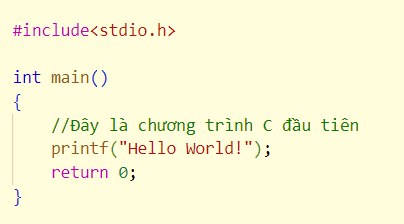
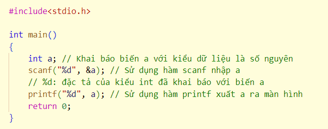

**C - Buổi 1: Chương trình C đầu tiên**

**Cấu trúc chương trình, các kiểu dữ liệu, toán tử và phép tính toán thông thường**

Kiến thức buổi 1:

[I. Cấu trúc chương trình C cơ bản](#cấu-trúc-chương-trình-c-cơ-bản)

[II. Các kiểu dữ liệu cơ bản](#các-kiểu-dữ-liệu-cơ-bản)

[III. Toán tử và phép tính toán thông thường](#toán-tử-và-phép-tính-toán-thông-thường)

# Cấu trúc chương trình C cơ bản

## Khái niệm về chương trình

-   **Chương trình (computer program)** là một **tập hợp các xử lý được ghi theo thứ tự** mà máy tính cần phải thực hiện. Trong ngôn ngữ C, **chương trình là một tập hợp các hàm, với mỗi hàm trong chương trình là “tập hợp các quy trình” cần xử lý** và có một ý nghĩa hơi khác với một hàm toán học.
-   Chương trình được viết để cuối cùng tạo ra một **ứng dụng** (application) nhằm thực hiện một điều gì đó. Một ứng dụng có thể đơn giản hoạt động theo một cách cố định, hoặc nó có thể hoạt động theo nhiều cách khác nhau tùy thuộc vào thao tác của người dùng. Và ứng dụng hoạt động như thế nào hoàn toàn phụ thuộc vào cách bạn viết chương trình mô tả nó.

## Cấu trúc cơ bản của chương trình C

-   Một chương trình C bao gồm những phần sau đây:
    -   Các lệnh tiền xử lý
    -   Các hàm
    -   Các biến
    -   Các lệnh và biểu thức
    -   Các comment
-   Đầu tiên hãy xem đoạn code đơn giản mà sẽ in ra màn hình hai từ "Hello World":

-   Hãy xem các thành phần của chương trình bên trên:
    -   Dòng đầu tiên của chương trình **\#include \<stdio.h\>** là lệnh tiền xử lý, nhắc nhở bộ biên dịch C thêm tệp stdio.h trước khi biên dịch.
        -   Một số thư viện chuẩn:
            -   stdio.h: Xuất, nhập với màn hình, file, bàn phím,…
            -   ctype.h: Kiểm tra các lớp ký tự (chữ số, chữ cái,…)
            -   string.h: Xử lý chuỗi và bộ nhớ
            -   math.h: Một số hàm toán học
            -   time.h: Các hàm về thời gian
            -   memory.h: Cấp phát và quản lý bộ nhớ động
            -   stdlib.h: Chuyển đổi dữ liệu số-chuỗi, cấp phát bộ nhớ,…
        -   Dòng tiếp theo **int main()** là hàm main, nơi chương trình bắt đầu.
        -   Dòng tiếp theo **//…** là dòng comment được bỏ qua bởi bộ biên dịch compiler và được dùng để thêm các chú thích cho chương trình. Đây được gọi là phần comment của chương trình.
        -   Dòng tiếp theo **printf(...)** là một hàm chức năng khác của ngôn ngữ C , in ra thông điệp "Hello, World!" hiển thị trên màn hình.
        -   Dòng tiếp theo **return 0;** kết thúc hàm chính và trả về giá trị 0.
    -   Một số quy tắc:
        -   Kết thúc câu lệnh bằng dấu chấm phẩy **;**
        -   Luôn có hàm main()
        -   Bắt đầu hàm bởi dấu { và kết thúc hàm bởi dấu }
        -   Sử dụng ký tự // để comment một dòng lệnh, hoặc cặp dấu /\* và \*/ để comment nhiều dòng lệnh.
        -   Sử dụng dấu cách, tab, xuống dòng để làm cấu trúc chương trình dễ hiểu hơn.

## Nhập xuất cơ bản

-   Thư viện nhập xuất chuẩn trong C là \<stdio.h\>, do đó các lập trình viên cần khai báo thư viện này trước khi thực hiện việc nhập xuất dữ liệu bằng chỉ thị \#include.
-   \<stdio.h\> cung cấp cho chúng ta hai hàm nhập và xuất dữ liệu có định dạng:
    -   **scanf(): Hàm nhập**
        -   Cú pháp: scanf(\<Chuỗi định dạng\>, \<danh sách tham số\>);
        -   Ví dụ:

                 int a; scanf(“%d”, \&a); 

            -   %d: đặc tả kiểu dữ liệu đã khai báo với biến a.
            -   \&a: con trỏ trỏ tới biến a.
        -   scanf() sử dụng những ký tự không được in như ký tự khoảng trắng, ký tự phân cách (tab), ký tự xuống dòng để quyết định khi nào một trường nhập kết thúc và bắt đầu. Do đó, đầu vào có thể được trải ra hơn một dòng, miễn là chúng ta có ít nhất một ký tự phân cách, khoảng trắng hay hàng mới giữa các trường nhập vào.
    -   **printf(): Hàm xuất**
        -   Cú pháp: printf(\<"chuỗi định dạng"\>, \<danh sách tham số\>)
        -   Ví dụ:

                 printf(“%d”, a); 

            -   %d: đặc tả kiểu dữ liệu đã khai báo với biến a.
            -   a: biến cần in.

# Các kiểu dữ liệu cơ bản

## Kiểu dữ liệu nguyên thủy

-   Tên tiếng Anh là Primitive Type, còn có thể gọi là kiểu dữ liệu gốc, kiểu dữ liệu có sẵn trong C. Bảng dưới đây liệt kê 7 kiểu dữ liệu cơ bản trong C/C++:

    | **Kiểu dữ liệu**      | **Từ khóa** |
    |-----------------------|-------------|
    | Boolean               | bool        |
    | Ký tự                 | char        |
    | Số nguyên             | int         |
    | Số thực               | float       |
    | Số thực dạng Double   | double      |
    | Kiểu không có giá trị | void        |
    | Kiểu Wide character   | wchar_t     |

## Tổng hợp các kiểu dữ liệu

| **Loại dữ liệu** | **Kiểu dữ liệu**   | **Đặc tả** | **Số ô nhớ** | **Dãy giá trị**                                          |
|------------------|--------------------|------------|--------------|----------------------------------------------------------|
| Void             | void               |            |              | Không có giá trị                                         |
| Boolean          | bool               |            | 1 byte       | 0 hoặc 1. Trong đó 0 là FALSE, 1 là TRUE                 |
| Ký tự            | char               | %c         | 1 byte       | -127 tới 127 hoặc 0 tới 255                              |
| Số nguyên        | int                | %d         | 4 byte       | -231 tới 231 – 1 (-109 tới 109)                          |
|                  | unsigned int       | %u         | 4 byte       | 0 tới 232 – 5 (0 tới 109)                                |
|                  | long long          | %lld       | 8 byte       | -263 tới 263 – 1 (-1018 tới 1018)                        |
|                  | unsigned long long | %llu       | 8 byte       | 0 tới 264 – 5 (0 tới 1019)                               |
| Số thực          | float              | %f         | 4 byte       | ±10-38 tới ±1038 (Độ chính xác: 6 chữ số thập phân)      |
|                  | double             | %lf        | 8 byte       | ±10-308 tới ±10308 (Độ chính xác: 15 chữ số thập phân)   |
|                  | long double        | %Lf        | 10 byte      | ±10-4932 tới ±104932 (Độ chính xác: 19 chữ số thập phân) |

-   Chú thích: unsigned là không dấu.

## Một số kí tự điều khiển

-   \\n : Xuống dòng
-   \\t : Tab ngang (tạo khoảng trắng giống như khi bạn ấn phím Tab trên bàn phím trong soạn thảo văn bản)
-   \\r : Nhảy về đầu hàng
-   \\a : Kêu Bip
-   \\\\ : In ra dấu \\
-   \\” : In ra dấu “
-   \\’ : In ra dấu ‘
-   %% : In ra dấu %

## Biến, hằng

### Giới thiệu

-   Biến, hằng giống như những chiếc hộp có tên riêng mà chúng ta có thể để dữ liệu vào và mang ra mỗi khi chúng ta cần sử dụng. Biến khác hằng ở chỗ giá trị lưu trữ trong biến có thể thay đổi trong quá trình thực hiện chương trình; còn giá thị của hằng thì được định nghĩa ngay từ đầu chương trình, không thay đổi trong suốt quá trình thực hiện chương trình.

### Các quy tắc đặt tên biến, hằng

-   Tên biến, tên hằng:
    -   **Chỉ** chứa các chữ cái, chữ số và kí tự gạch dưới ( \_ ) trong [bảng mã ASCII](https://vi.wikipedia.org/wiki/ASCII).
    -   **Phải** bắt đầu bằng một chữ cái hoặc kí tự gạch dưới.
    -   **Không** được trùng với các từ khóa trong ngôn ngữ C.
    -   **Phân biệt hoa thường**. C là ngôn ngữ phân biệt hoa thường, do vậy biến aBc và abc là khác nhau trong C.
    -   Danh sách các từ khóa trong ngôn ngữ C:

        | break    | enum   | register | typedef  |
        |----------|--------|----------|----------|
        | case     | extern | return   | union    |
        | char     | float  | short    | unsigned |
        | const    | for    | signed   | void     |
        | continue | goto   | sizeof   | volatile |
        | default  | if     | static   | while    |
        | do       | int    | struct   | \_Packed |
        | double   |  auto  |  switch  | struct   |

-   **Ví dụ:**
    -   **Tên đúng:** abc, Abc, abc123, \_abc
    -   **Tên sai:** 1abc (tên sai do bắt đầu bằng số), b@c (tên sai do chứa kí tự @ không được phép), case (tên sai do trùng với từ khóa).

### Khai báo biến

-   **Vị trí khai báo**: Biến thường được khai báo ở đầu chương trình, đầu hàm hoặc khối lệnh.
-   Có 2 loại biến theo vị trí khai báo:
    -   **Biến toàn cục:** biến khai báo ở ngoài các hàm, các khối lệnh. Chu trình sống của chúng từ lúc bắt đầu chương trình tới khi kết thúc chương trình.
    -   **Biến cục bộ:** biến khai báo bên trong các hàm, các khối lệnh. Chu trình sống từ khi bắt đầu khối lệnh tới khi khối lệnh được thực hiện xong.
-   **Cú pháp khai báo biến**: \<kiểu dữ liệu\>\<danh sách biến\>;
-   **Ví dụ**:

    

### Khai báo hằng

-   Khai báo hằng được thực hiện ở đầu chương trình.
    -   **Cách 1: Sử dụng bộ tiền xử lí**

        **\#define** \<tên hằng\> \<giá trị của hằng\> 
        

        -   Ví dụ: \#define k 100
    -   **Cách 2:**

        **const** \<kiểu dữ liệu\> \<tên hằng\> = \<giá trị của hằng\>; 

        -   Ví dụ: const int k = 100;
        -   Tên hằng thường được viết in hoa.

# Toán tử và phép tính toán thông thường

## Một số khái niệm:

### Toán tử là gì?

-   Toán tử là một biểu tượng mà nói với trình biên dịch thực hiện một phép toán học nhất định hoặc thao tác hợp lý.
-   Các loại toán tử:
    -   Toán tử số học
    -   Toán tử gán
    -   Toán tử quan hệ
    -   Toán tử logic
    -   Toán tử điều kiện

### Toán hạng là gì?

-   Là các biến tham gia trong toán tử

### Ví dụ:
### a + b

-   a, b là toán hạng
-   ‘+’ là toán tử

## Các loại toán tử

### Toán tử số học

-   Cho biến a=40, b=20, ta có các toán tử số học sau:

    | **Toán tử** | **Giải thích**              | **Code**     | **Kết quả** |
    |-------------|-----------------------------|--------------|-------------|
    | +           | cộng 2 toán hạng            | a+b          | 60          |
    | -           | trừ 2 toán hạng             | a-b          | 20          |
    | \*          | nhân 2 toán hạng            | a\*b         | 800         |
    | /           | chia 2 toán hạng            | a/b          | 2           |
    | %           | chia lấy dư 2 toán hạng     | a%b          | 0           |
    | ++          | tăng toán hạng lên 1 đơn vị | a++ hoặc ++a | 41          |
    | --          | giảm toán hạng đi 1 đơn vị  | a—hoặc --a   | 39          |

-   **Ví dụ**:
    -   a = 15, b = 10. In ra a / b, ++a, b++
    -   Kết quả: 1 16 10
-   **Note:**
    -   Vì cùng kiểu số nguyên nên 15 / 10 = 1, muốn cho giá trị đúng là 1.5 thì phải ép kiểu

             int a= 15, b=10; printf(“%f”, (float) a / b); → 1.5 

    -   Muốn lấy x chữ số thập phân sau dấu phẩy thì dùng lệnh **%.xf**
    -   Nếu không thực hiện phép toán thì **++a** giống **a++**
    -   Nếu thực hiện phép toán thì có sự khác nhau:
        -   \++a: tăng giá trị a lên 1 đơn vị rồi mới thao tác toán tử với a
        -   a++: thao tác toán tử với a rồi mới tăng giá trị a lên 1 đơn vị

                 int a = 4; printf(“%d”, ++a) → 5 
                 a = 4; printf(“%d”, a++) → 4 

        -   \--a và a-- tương tự

### Toán tử gán mở rộng

| **Toán tử** | **Code** | **Giải thích** |
|-------------|----------|----------------|
| +=          | a += b   | a = a + b      |
| -=          | a -= b   | a = a - b      |
| \*=         | a \*= b  | a = a \* b     |
| /=          | a /= b   | a = a / b      |
| %=          | a %= b   | a = a % b      |
