**C - Buổi 2: Toán tử, cấu trúc rẽ nhánh và vòng lặp**

**Nhắc lại kiến thức buổi 1:**

      Hàm nhập: scanf()
      
      Hàm xuất: printf()
      
      Các hàm trong thư viện math.h: pow(), sqrt(), abs(), sin(), cos(), log(),....

**Kiến thức buổi 2:**

[I. Tiếp tục về toán tử](#tiếp-tục-về-toán-tử)

[II. Các cấu trúc rẽ nhánh](#các-cấu-trúc-vòng-lặp)

[III. Các cấu trúc vòng lặp](#các-cấu-trúc-vòng-lặp)

# Tiếp tục về toán tử

## Toán tử quan hệ (so sánh)

| **Toán tử** | **Giải thích**                                                                         |
|-------------|----------------------------------------------------------------------------------------|
| ==          | Kiểm tra 2 toán hạng có giá trị bằng nhau không                                        |
| !=          | Kiểm tra 2 toán hạng có giá trị khác nhau không                                        |
| \>          | Kiểm tra nếu toán hạng bên trái có giá trị lớn hơn toán hạng bên phải hay không.       |
| \>=         | Kiểm tra nếu toán hạng bên trái có giá trị lớn hơn hoặc bằng toán hạng bên phải không. |
| \<          | Kiểm tra nếu toán hạng bên trái có giá trị nhỏ hơn toán hạng bên phải không.           |
| \<=         | Kiểm tra nếu toán hạng bên trái có giá trị nhỏ hơn hoặc bằng toán hạng bên phải không. |

## Toán tử logic

### Toán tử logic

| **Toán tử** | **Giải thích**                                    |
|-------------|---------------------------------------------------|
| &&          | Cùng kết hợp các điều kiện                        |
| \|\|        | Thỏa mãn ít nhất 1 trong các điều kiện            |
| !           | Đảo ngược trạng thái logic (0 thành 1, 1 thành 0) |

### Bảng chân trị

| **a** | **b** | **&&** | **\|\|** |
|-------|-------|--------|----------|
| 0     | 1     | 0      | 1        |
| 1     | 0     | 0      | 1        |
| 0     | 0     | 0      | 0        |
| 1     | 1     | 1      | 1        |

## Toán tử điều kiện

-   Xem phần 1.3 thuộc phần 1. If – else trong phần II. Cấu trúc rẽ nhánh

# Các cấu trúc rẽ nhánh

## If - else

### Dạng thiếu

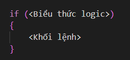

-   Cách chương trình thực thi: Kiểm tra biểu thức logic, nếu đúng thực hiện khối lệnh, nếu sai thì bỏ qua.

### Dạng đủ

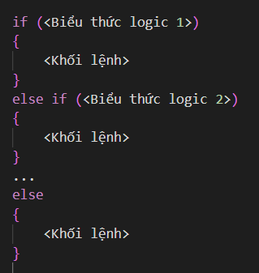

Dấu 3 chấm là có thể viết nhiều else if

-   Cách chương trình thực thi: Kiểm tra biểu thức logic 1, nếu đúng thực hiện khối lệnh, nếu sai thì tiếp tục kiểm tra biểu thức logic 2, nếu vẫn sai thì kiểm tra các biểu thức tiếp theo. Else là tất cả trường hợp còn lại không thuộc các trường hợp ở trên.
-   Sơ đồ khối:

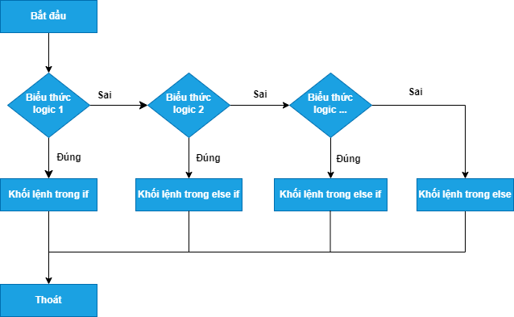

### Dạng rút gọn hay toán tử điều kiện:

      <Điều kiện> ? <Biểu thức 1> : <Biểu thức 2>; 

-   Cách chương trình thực thi: Kiểm tra điều kiện, nếu đúng thực hiện biểu thức 1, nếu sai thực hiện biểu thức 2.

## Switch – case

### Cấu trúc:

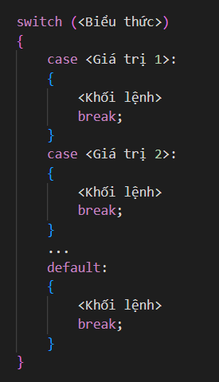

Dấu 3 chấm là có thể viết nhiều case

-   Trong đó, \<Biểu thức\> là một biến/ biểu thức, hoặc hàm có giá trị, thường là kiểu số nguyên hoặc chuỗi – kí tự. Các \<giá trị 1, 2, …\> phải là các hằng số.
-   Cách chương trình thực thi: Lấy biểu thức kiểm tra lần lượt các case, nếu trùng với giá trị của một case nào đó sẽ thực hiện khối lệnh trong đó, nếu không trùng với bất kỳ giá trị nào trong danh sách thì sẽ thực hiện khối lệnh trong default.
-   Trong trường hợp có nhiều giá trị có chung công việc thực hiện, ta có thể viết như sau:

    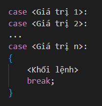

-   Sơ đồ khối:

    

### Khi nào dùng switch case??

-   Số lượng điều kiện là lớn như dạng menu chọn, danh sách, … -\> switch case viết sẽ mạch lạc và dễ kiểm soát.
-   Các trường hợp điều kiện phải có giá trị là số nguyên hoặc chuỗi – kí tự.

    =\> Còn lại hãy dùng if – else 😎

### Điều gì sẽ xảy ra nếu thiếu câu lệnh break??

-   Chương trình vẫn sẽ thực hiện các lệnh cho đến khi gặp lệnh break hoặc kết thúc thì thoát switch - case ra.

## Áp dụng

-   [Tìm số ngày của tháng - Luyện Code Online (luyencode.net)](https://oj.luyencode.net/problem/DK10)  
    Biết năm nhuận là một năm chia hết cho 4 hoặc 400.
-   Kiểm tra xem số nhập vào có phải số nguyên tố không, cho biết số nhập vào nằm trong khoảng 1 – 10, nếu là số nguyên tố in ra “YES”, ngược lại in ra “NO”.

# Các cấu trúc vòng lặp

## For

### Cấu trúc

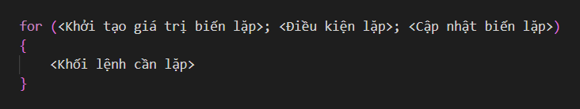

-   Các bước chương trình thực thi:
    -   B1: Khởi tạo giá trị biến lặp, chỉ thực hiện 1 lần duy nhất.
    -   B2: Kiểm tra điều kiện lặp, nếu điều kiện sai =\> Chuyển sang B5.
    -   B3: Thực hiện khối lệnh cần lặp ở trong thân vòng lặp.
    -   B4: Cập nhật giá trị biến lặp =\> Quay lại B2.
    -   B5: Kết thúc vòng lặp
    -   Sơ đồ khối:

        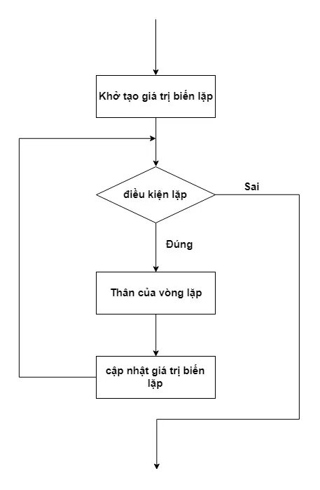

### Ví dụ

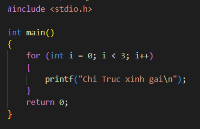

-   Giải thích:
    -   B1: Gán biến lặp i = 0.
    -   B2: Kiểm tra điều kiện i (i = 0) \< 3 =\> Đúng.
    -   B3: Do kiểm tra điều kiện đúng =\> Thực hiện thân vòng lặp for.
    -   B4: Gọi tới i++ =\> Tăng i lên 1 đơn vị =\> i = 1.
    -   B5: Kiểm tra điều kiện i (i = 1) \< 3 =\> Đúng.
    -   B6: Do kiểm tra điều kiện đúng =\> Thực hiện thân vòng lặp for.
    -   B7: Gọi tới i++ =\> Tăng i lên 1 đơn vị =\> i = 2.
    -   B8: Kiểm tra điều kiện i (i = 2) \< 3 =\> Đúng.
    -   B9: Do kiểm tra điều kiện đúng =\> Thực hiện thân vòng lặp for.
    -   B10: Gọi tới i++ =\> Tăng i lên 1 đơn vị =\> i = 3.
    -   B11: Kiểm tra điều kiện i (i = 3) \< 3 =\> Sai =\> Kết thúc vòng lặp.
-   Kết quả chạy:

    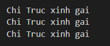

-   Lưu ý: Phần \<Khởi tạo biến lặp\>, \<Điều kiện lặp\> và \<Cập nhật biến lặp\> có thể có 1 biến, nhiều biến hoặc thậm chí không có biến nào.

## While

### Cấu trúc

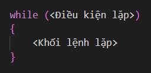

-   Các bước chương trình thực thi:
    -   B1: Kiểm tra điều kiện lặp:
        -   Đúng =\> B2.
        -   Sai =\> B3.
    -   B2: Thực hiện khối lệnh lặp =\> Quay lại B1.
    -   B3: Thoát vòng lặp.
    -   Sơ đồ khối:

        

### Ví dụ

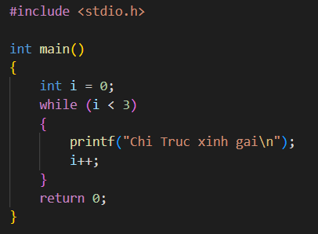

-   Giải thích:
    -   B1: Kiểm tra điều kiện i (i = 0) \< 3 =\> Đúng.
    -   B2: Do kiểm tra điều kiện đúng =\> Thực hiện thân vòng lặp while.
    -   B3: Kiểm tra điều kiện i (i = 1) \< 3 =\> Đúng.
    -   B4: Do kiểm tra điều kiện đúng =\> Thực hiện thân vòng lặp while.
    -   B5: Kiểm tra điều kiện i (i = 2) \< 3 =\> Đúng.
    -   B6: Do kiểm tra điều kiện đúng =\> Thực hiện thân vòng lặp while.
    -   B7: Kiểm tra điều kiện i (i = 3) \< 3 =\> Sai =\> Kết thúc vòng lặp.
-   Kết quả chạy:

    

-   Nếu đề bài yêu cầu bộ test thì ta viết như sau:

    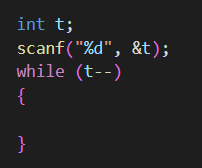

### Sự khác nhau và giống nhau của for và while??

-   Giống: Đều là vòng lặp.
-   Khác:
    -   For: Câu lệnh lặp có số lần biết trước.
    -   While: Câu lệnh lặp có số lần chưa biết.

## Do – while

### Cấu trúc:

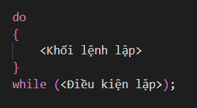

-   Các bước chương trình thực thi:
    -   B1: Thực hiện khối lệnh trong do**.**
    -   B2: Kiểm tra điều kiện lặp:

        -   Nếu đúng =\> Quay lại B1.
        -   Nếu sai =\> Thoát vòng lặp.
    -   Sơ đồ khối:

        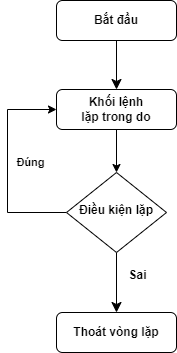

-   Vòng lặp **do – while** khá giống với vòng lặp **while**. Tuy nhiên nó có một điểm khác biệt đó là vòng lặp **do – while** sẽ chạy ít nhất 1 lần cho dù điều kiện có đúng hay sai.

### Ví dụ

-   **\#1:** In ra 3 dòng “Chi Truc xinh gai”.

    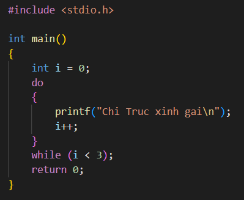

    -   Giải thích:
        -   B1: Thực hiện khối lệnh trong do.
        -   B2: Kiểm tra i (i = 1) \< 3 =\> Đúng.
        -   B3: Do kiểm tra điều kiện đúng =\> Thực hiện khối lệnh trong do.
        -   B4: Kiểm tra i (i = 2) \< 3 =\> Đúng.
        -   B5: Do kiểm tra điều kiện đúng =\> Thực hiện khối lệnh trong do.
        -   B6: Kiểm tra i (i = 3) \< 3 =\> Sai =\> Dừng vòng lặp.
    -   Kết quả chạy:

        

-   **\#2:** Nhập vào một số nguyên dương từ bàn phím và in ra số đó. Nếu sai thì nhập lại.

    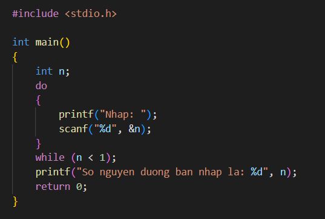

-   Giải thích:
    -   B1: Thực hiện khối lệnh trong do.
    -   B2: Kiểm tra điều kiện xem n vừa nhập vào có bé hơn 1 không:
        -   Bé hơn =\> Đúng =\> Quay lại B1.
        -   Lớn hơn hoặc bằng =\> Sai =\> Dừng vòng lặp.
-   Kết quả chạy:

    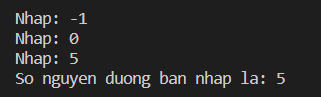

## Lệnh break và continue:

-   Lệnh **break** và **continue** là các lệnh kiểm soát vòng lặp, 2 lệnh này cho phép chúng ta quản lý và làm việc với vòng lặp trở nên hiệu quả hơn.
-   Cách hoạt động của lệnh **break**: Một vòng lặp đang thực hiện nếu gặp lệnh **break** sẽ thoát vòng lặp ngay lập tức.

-   **Ví dụ:** Nhập và in ra số nguyên âm, nếu nhập sai nhập lại, nhập tối đa 5 lần (Sử dụng **break).**

    

-   Cách hoạt động của lệnh **continue**: Nếu một vòng lặp đang chạy mà gặp lệnh **continue**, tất cả các lệnh trong thân vòng lặp nằm phía dưới lệnh **continue** sẽ bị bỏ qua ở lần lặp hiện tại.

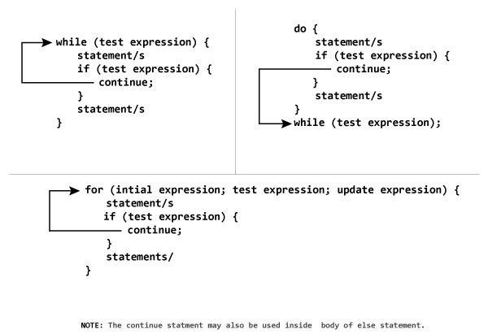

-   **Ví dụ:** In ra các chữ số lẻ từ 1 – 100 (Sử dụng **continue**).

    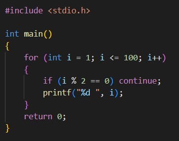

## Áp dụng

-   Bài 1:

    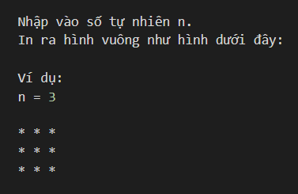

-   Bài 2:

    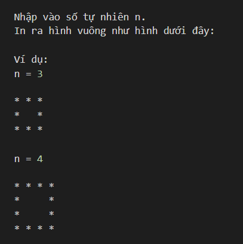
