**C - Buổi 3: Hàm, mảng 1 chiều và kỹ thuật mảng đánh dấu**

Kiến thức buổi 3:

[I. Hàm](#hàm-chương-trình-con)

[II. Mảng 1 chiều](#mảng-1-chiều)

[III. Kỹ thuật mảng đánh dấu](#kỹ-thuật-mảng-đánh-dấu)

# Hàm (Chương trình con)

## Mở đầu

### Chém gió một chút 😂

-   Giả sử bạn muốn xây dựng một chương trình máy tính cơ bản với 4 chức năng: tính tổng, hiệu, nhân, chia của 2 số nguyên nhập từ bàn phím.
-   Nếu bạn làm một mình và tự làm hết cả 4 công việc trên (code tất cả trong hàm **main()**). Nhưng bạn thử nghĩ xem, bạn để cả 4 chức năng trong đó thì liệu bạn có thể quản lý nó được tốt không? Bạn có thể tối ưu và phát triển dễ dàng mỗi công việc đó không? Hoặc đơn giản là lúc cần dùng tới một trong số chúng chẳng nhẽ bạn phải đi viết lại?
-   **Giải pháp:** Kiếm thêm 4 ông bạn và tạo thành một team, làm việc nhóm hiệu quả, mỗi ông (hàm con) chỉ làm một việc duy nhất. Khi đó, công việc của trưởng nhóm là bạn (hàm **main()**) quản lý các thành viên này, khi nào cần thì gọi ông bạn ấy ra làm cho mình và nếu có vấn đề gì ở một công việc nào đó thì cứ lôi cổ ông bạn đó ra mà xử lý 🤣.
-   Vậy thì hàm cũng thế, hàm chính là các ông bạn thành viên trong vấn đề phía trên. Và qua câu chuyện mà mình chém gió ở trên thì các bạn cũng có thể thấy được tầm quan trọng của teamwork hiệu quả 😉.

### Định nghĩa

-   Hàm là các khối lệnh nhỏ chỉ thực hiện một chức năng nhất định của bài toán lớn.

## Tại sao phải viết hàm??

-   Sau đây là một số **ưu điểm nổi bật** của sử dụng chương trình con (hàm) mà mình có thể liệt kê, nhưng có một điều chắc chắn rằng: Hãy cố gắng thực hành viết code của bạn sử dụng hàm nếu có thể nhé.
-   Sử dụng chương trình con khiến **code bạn trông sáng sủa hơn và gọn gàng**, người đọc code sẽ dễ hiểu hơn bằng cách nhìn vào từng hàm con ta có thể dễ dàng xác định vai trò của nó trong chương trình.
-   **Dễ dàng quản lý, nâng cấp và tìm lỗi chương trình.** Bởi vì bạn biết rõ hàm nào đang làm gì, nếu mà chẳng may gặp lỗi thì bạn cũng nhanh chóng xác định lỗi đó của hàm nào thay vì phải dò từng dòng trong hàm main.
-   **Viết 1 lần và gọi được ở nhiều nơi:** Khi bạn dùng hàm thì bạn chỉ phải viết một lần và gọi tới nó bất cứ khi nào bạn muốn. Bạn cũng có thể đóng gói các hàm đó để sử dụng cho các chương trình khác.

## Cách mà hàm hoạt động

-   Hình ảnh dưới đây cho bạn thấy cách hoạt động của hàm (chương trình con) ở trong ngôn ngữ C. Khi một lời gọi hàm được thực thi thì:
    -   B1: Chương trình của bạn sẽ nhảy tới nơi định nghĩa hàm đó và thực thi các lệnh từ trên xuống dưới ở trong hàm đó.
    -   B2: Khi hàm thực hiện xong, chương trình tiếp tục quay về thực hiện các lệnh phía sau lời gọi hàm.

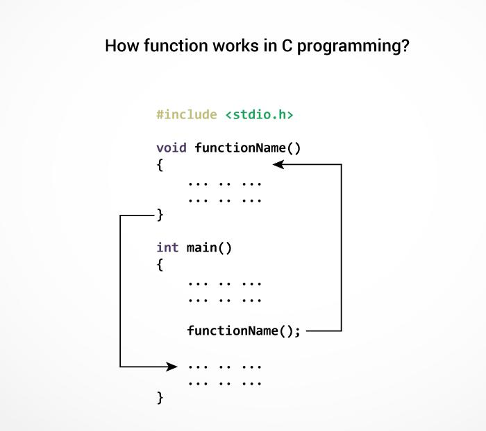

## Phân loại hàm

### Hàm có giá trị trả về

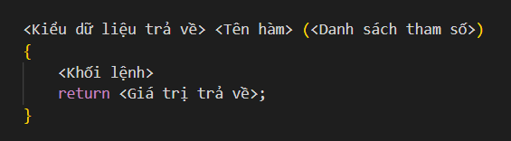

-   Ví dụ:

    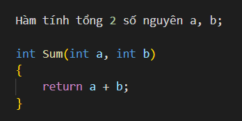

### Hàm không có giá trị trả về

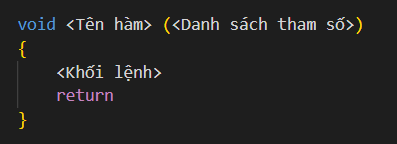

-   return có cũng được không có cũng được.
-   Ví dụ:

    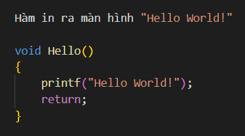

### Lưu ý

-   \<Danh sách tham số\> có thể có 1 tham số, nhiều tham số, hoặc không có tham số nào.
-   Có thể gọi một hàm từ hàm khác nhưng bạn không được định nghĩa hàm bên trong hàm (kể cả hàm main()).
-   Kiểu dữ liệu của \<Giá trị trả về\> nên cùng kiểu (nhưng không được to hơn) với kiểu dữ liệu của hàm.
-   Bạn có thể định nghĩa hàm nằm trên hoặc dưới hàm main(). Trong trường hợp bạn muốn định nghĩa hàm nằm dưới hàm main() thì bạn cần phải khai báo hàm.
-   Mỗi hàm chỉ có thể trả về được duy nhất một giá trị.
-   Nơi mà hàm trả về giá trị chính là nơi mà nó được gọi

## Lời gọi hàm

### Định nghĩa

-   Các hàm thường giao tiếp hay gọi đến nhau bằng **lời gọi hàm (call function)**. Việc giao tiếp hay gọi đến nhau của các hàm thông qua cách truyền tham số.
-   **Tham số** là các biến có kiểu và tên được sử dụng để nhận các giá trị truyền vào để xử lý trong hàm. Các tham số sử dụng trong hàm đều cần chỉ định kiểu dữ liệu và tên của nó. Kiểu dữ liệu cần phải giống với kiểu dữ liệu của đối tượng mà nó sẽ nhận khi đối tượng đó được truyền vào hàm.

    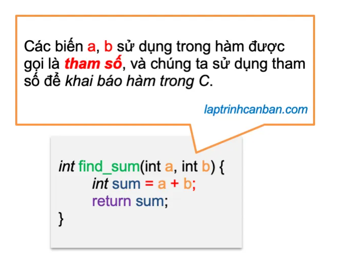

-   **Đối số** là các giá trị được truyền vào khi gọi hàm. Đối số được truyền vào hàm sẽ được gán vào tham số. Cần chú ý kiểu dữ liệu phải cùng kiểu với tham số tương ứng trong hàm.

    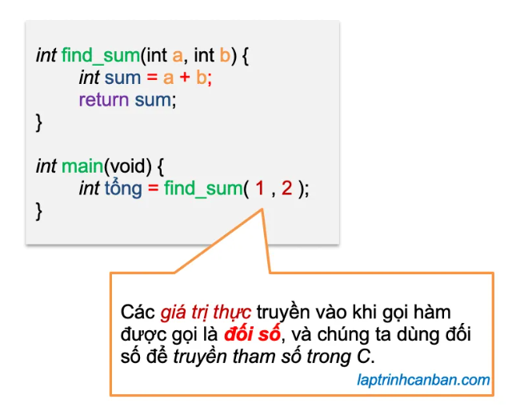

-   Quy trình thực hiện truyền tham số:

    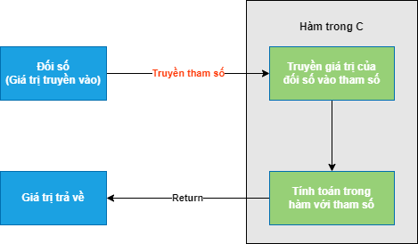

-   Các tham số được truyền theo một trong hai cách sau đây:

### Truyền tham số bằng tham trị (hay giá trị)

-   Đây là lời gọi hàm mà trong đó đối số thực sự không thay đổi giá trị sau khi hàm được gọi thực hiện xong công việc. Truyền bằng tham trị là lời gọi mặc định trong C.

### Truyền tham số bằng con trỏ

-   Bản chất của truyền bằng con trỏ là truyền địa chỉ của biến. Cách này có thể thay đổi giá trị của đối số. Việc truyền con trỏ trong C được thực hiện thông qua con trỏ (con trỏ đơn giản là một biến lưu địa chỉ của biến mà con trỏ trỏ tới, khai báo \<Kiểu dữ liệu\>\* \<Tên biến\>, mình sẽ được học kĩ hơn ở buổi về con trỏ sau này).

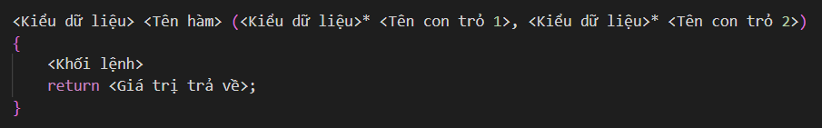

-   Ví dụ:

    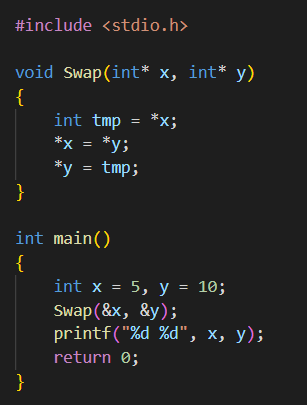

-   Kết quả: 10 5
-   Nếu không dùng phương pháp trên thì chương trình sẽ không thể thực hiện được mục đích, tức là 2 số x và y vẫn giữ nguyên giá trị sau lời gọi hàm.

# Mảng 1 chiều

## Mảng 1 chiều là cái quái gì ??

-   Mảng là một tập hợp tuần tự các phần tử có cùng kiểu dữ liệu và các phần tử được lưu trữ trong một dãy các ô nhớ liên tục trên bộ nhớ. Các phần tử của mảng được truy cập bằng cách sử dụng “chỉ số”. Mảng có kích thước N sẽ có chỉ số từ 0 tới N – 1.
-   Ví dụ, với N = 5, khi đó chỉ số mảng (tiếng Anh là index) sẽ có giá trị từ 0 tới 4 (5 - 1) tương ứng với 5 phần tử.
-   Minh họa mảng 1 chiều:

    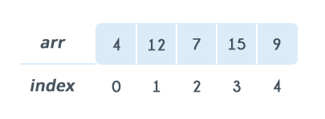

-   Khai báo mảng:
    -   Khai báo nhưng không khởi tạo:

            <Kiểu dữ liệu> <Tên mảng>[<Số phần tử>];

        Ví dụ: int arr[100];

    -   Vừa khai báo vừa khởi tạo:

            <Kiểu dữ liệu> <Tên mảng>[<Số phần từ>] = {<Danh sách phần tử>};

        Ví dụ: int arr[5] = {1, 2, 3, 4, 5};

    -   Khởi tạo mảng với số lượng phần tử chưa biết trước:

            <Kiểu dữ liệu> <Tên mảng>[] = {<Danh sách phần tử>};

        Ví dụ: int arr[] = {1, 2, 3, 4, 5};

## Các thao tác với mảng 1 chiều

-   Truy vấn phần tử trong mảng: \<Tên mảng\>[\<Chỉ số\>]

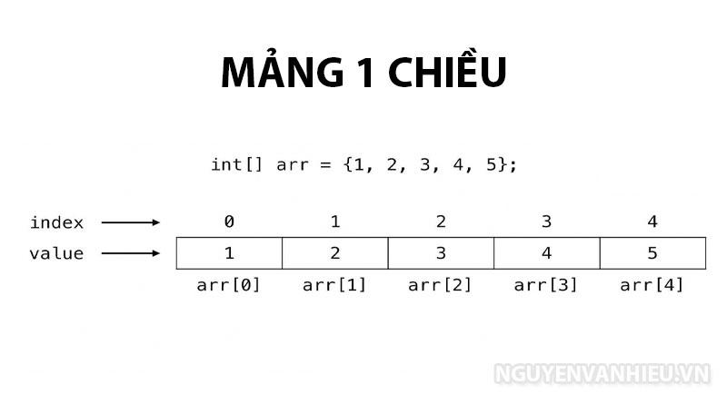

-   Thao tác nhập và xuất mảng:

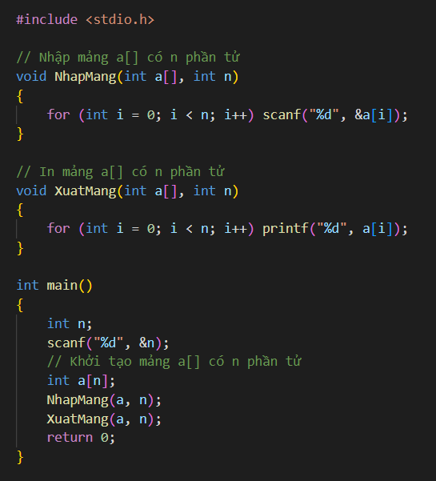

# Kỹ thuật mảng đánh dấu

## Một kỹ thuật rất hay:

-   Đợt trước, mình được anh chị dạy kỹ thuật này vào buổi chữa bài tập về mảng, ban đầu mình thấy hơi khó hiểu, có lẽ do mình dốt :(. Tuy nhiên, sau một thời gian sử dụng, mình thấy đây là một kỹ thuật quá hay mà lại dễ dùng và dễ hiểu (hơi tự vả :v). Mình nghĩ rằng ai cũng biết đến kỹ thuật này, nhưng khi hỏi một số người bạn của mình thì lạ thay là đa phần các bạn đều không biết tới kỹ thuật này. Vì vậy nên mình đưa kỹ thuật này vào giảng dạy cho các bạn ứng dụng 😎.

## Ví dụ và áp dụng

-   Bài 1: Quảng cáo (Codeforces)

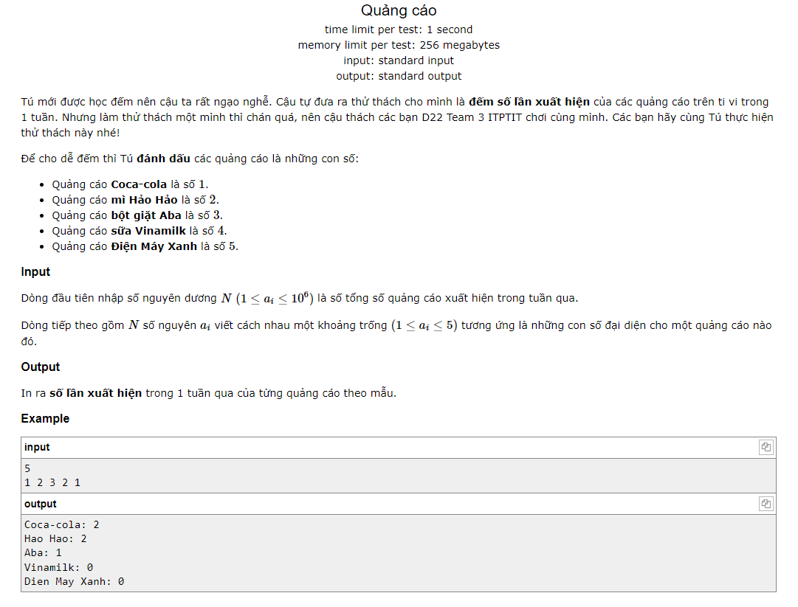

-   Bài 2: Hai lớp học (Codeforces)

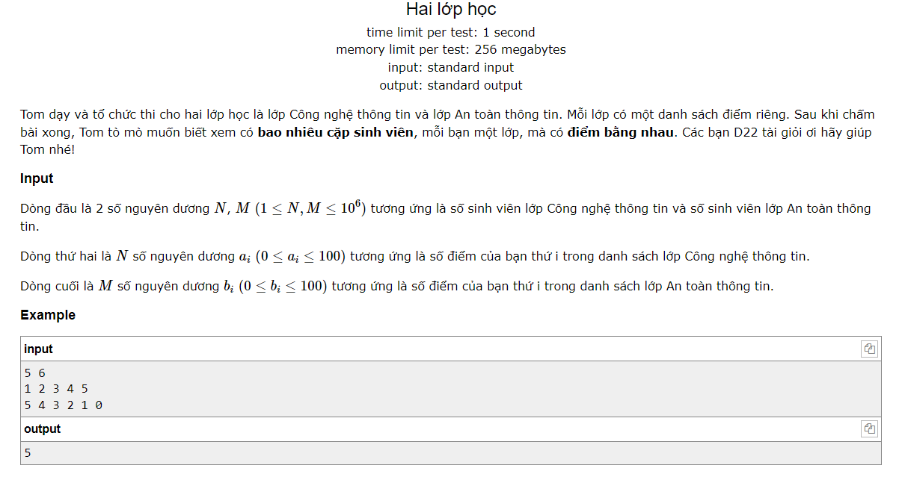

-   Bài 3: Điểm danh (Codeforces)

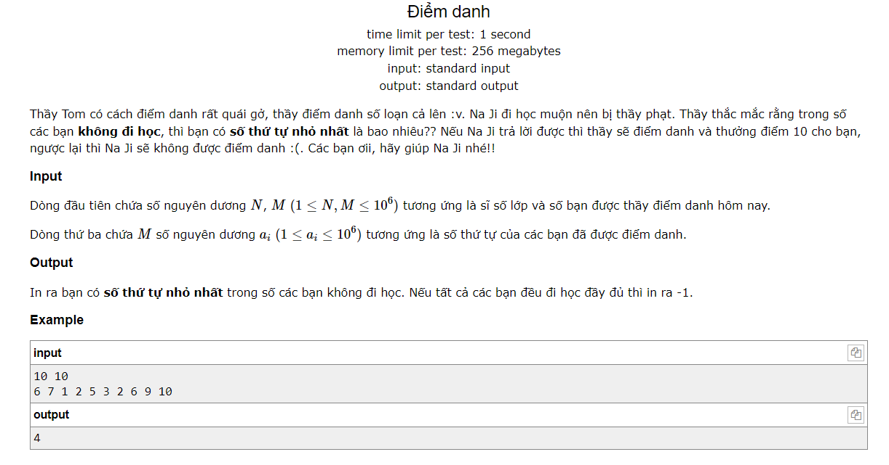
