**C - Buổi 4: Sàng nguyên tố, thuật toán sắp xếp và tìm kiếm cơ bản**

Kiến thức buổi 4:

[I. Sàng nguyên tố (Sieve of Eratosthenes)](#sàng-nguyên-tố-sieve-of-eratosthenes)

[II. Thuật toán sắp xếp nổi bọt (Bubble Sort)](#thuật-toán-sắp-xếp-nổi-bọt-bubble-sort)

[III. Thuật toán tìm kiếm cơ bản](#thuật-toán-tìm-kiếm-cơ-bản)

# Sàng nguyên tố (Sieve of Eratosthenes)

## Giới thiệu

-   Số nguyên tố là số nguyên dương lớn hơn 1 và chỉ có đúng hai ước là 1 và chính nó.
-   Hợp số là các số nguyên dương lớn hơn 1 và có nhiều hơn hai ước.
-   Lấy ví dụ: 5 là một số nguyên tố, vì nó chỉ có đúng hai ước là 1 và 5. Ngược lại 10 là một hợp số vì nó có bốn ước là 1, 2, 5, 10.
-   Số nguyên tố và các vấn đề xoay quanh nó luôn là chủ đề được yêu thích trong toán học và trong lập trình.

## Kiểm tra tính nguyên tố (Bonus)

### Giải thuật cơ sở

-   Ý tưởng ban đầu rất đơn giản: Ta duyệt qua tất cả các số nguyên từ 2 tới N - 1, nếu như có số nào là ước của N thì kết luận N không phải số nguyên tố. Vòng lặp phải chạy đến N lần.
-   Code:

    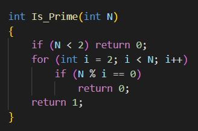

### Cải tiến

-   Nhận xét: Giả sử số nguyên dương N có ước là D (0 \< D ≤ ), khi đó N sẽ có thêm một ước là ( ≤ ≤ N). Như vậy ta chỉ cần kiểm tra các số nguyên từ 2 tới xem N có chia hết cho số nào không, nếu không ta kết luận N là số nguyên tố. Như vậy vòng lặp chỉ phải chạy đến lần, nhanh hơn giải thuật ở trên.
-   Code:

    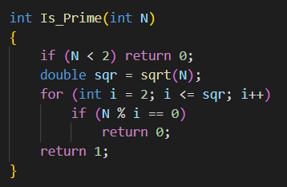

-   Lưu ý: Phải khởi tạo biến sqr ở ngoài vòng lặp để tính , nếu để bên trong vòng lặp thì lần lặp nào nó cũng phải tính lại , điều này khiến máy chạy tốn thời gian.

## Sàng nguyên tố Eratosthenes

### Giới thiệu

-   Sàng Eratosthenes là một giải thuật cổ xưa do nhà toán học người Hy Lạp Eratosthenes phát mình ra để tìm các số nguyên tố nhỏ hơn 100. Tương truyền, khi tìm ra thuật toán, ông đã lấy lá cọ và ghi tất cả các số từ 2 đến 100 lên đó, sau đó chọc thủng các hợp số và giữa nguyên các số nguyên tố. Bảng số nguyên tố còn lại trông rất giống một cái sàng. Do đó, nó có tên là sàng Eratosthenes.

    

### Ý tưởng

-   Dựa theo lý thuyết về số nguyên tố ở trên: Một số nguyên tố là số chỉ có 2 ước là 1 và chính nó. Do vậy, nếu ta xác định được số x là số nguyên tố, ta có thể kết luận mọi số chia hết cho x đều không phải số nguyên tố. Do đá ta đã loại bỏ được rất nhiều số mà không cần kiểm tra.
-   Ví dụ:
    -   Số 2 là số nguyên tố =\> các số 4, 6, 8, 10, … không phải số nguyên tố.
    -   Số 3 là số nguyên tố =\> 9, 15, 21, … không phải số nguyên tố. (Do 6, 12, 18 đã bị loại ở số 2 nên ta không phải xét nữa!)

### Thuật toán

-   Các bước:
    -   B1: Tạo mảng đánh dấu cho tất cả các phần tử từ 2 đến N và mặc định tất cả đều là số nguyên tố.
    -   B2: Xét số đầu tiên tìm được là số nguyên tố - giả sử x, đánh dấu tất cả các ước của x: 2x, 3x, 4x, … trong đoạn [x, N] không phải số nguyên tố.
    -   B3: Tìm số tiếp theo được đánh dấu là số nguyên tố trong [x, N]. Nếu không còn số nào, thoát chương trình. Nếu còn, gán nó bằng x và lặp lại B2.
    -   B4: Khi kết thúc, các số không bị đánh dấu là các số nguyên tố.
-   Minh họa giải thuật:

    

-   Code:

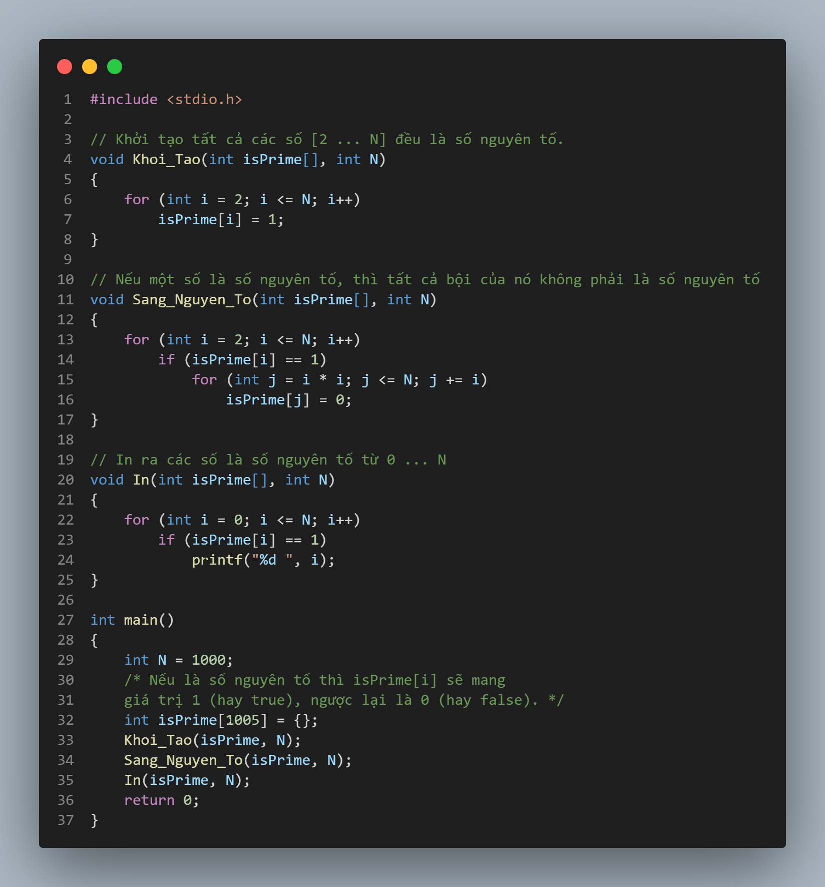

# Thuật toán sắp xếp nổi bọt (Bubble Sort)

## Tư tưởng thuật toán

-   Bubble Sort là liên tục duyệt trên một mảng chưa được sắp xếp, so sánh các cặp phần tử lân cận và hoán đổi chúng nếu chúng không theo đúng thứ tự, cho đến khi không có hoán đổi nào xảy ra, điều này cho biết mảng hiện tại đã được sắp xếp.
-   Thuật toán này đơn giản để học và dễ hiểu, nhưng chạy quá chậm và không thực tế khi so sánh với các thuật toán nâng cao hơn như Quick sort, Merge sort, …
-   Trường hợp tốt nhất của Bubble sort khi mảng đầu vào gần như đã được sắp xếp.
-   Trường hợp xấu nhất của Bubble sort là khi phần tử nhỏ nhất ở cuối mảng.
-   Dưới đây là minh họa cách hoạt động của thuật toán:

    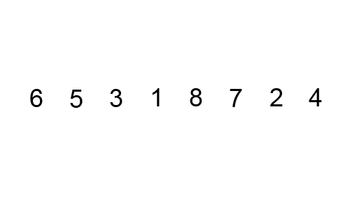

## Các bước thực hiện

-   Bài toán cho mảng a[] = {4, 1, 3, 2, 5}, hãy đưa ra mảng a[] đã được sắp xếp.
    -   Bước 1: Đầu tiên, chúng ta sẽ duyệt từ đầu đến cuối mảng, tại mỗi lần duyệt chúng ta sẽ so sánh phần tử hiện tại với phần tử kế tiếp nó và đổi chỗ nếu cần thiết, thực hiện liên tục cho đến cuối mảng.
        1.	[4 	1 	3 	2 	5]  ⇨  [1 	4 	3 	2 	5]  Swap vì 4 > 1.
        2.	[1 	4 	3 	2 	5]  ⇨  [1 	3 	4 	2 	5]  Swap vì 4 > 3.
        3.	[1 	3 	4 	2 	5]  ⇨  [1 	3 	2 	4 	5]  Swap vì 4 > 2.
        4.	[1 	3 	2 	4 	5]  ⇨  [1 	3 	2 	4	5]  Không swap vì 4 < 5.

    -   Bước 2: Kết thúc lần duyệt đầu tiên, thuật toán đã xác định rằng [5] là số lớn nhất trong mảng và đã được đưa về đúng vị trí (Vị trí cuối mảng). Thuật toán bây giờ sẽ bắt đầu duyệt lần 2 và bỏ qua vị trí index = 4 do phần tử lớn nhất đã được đặt đúng vị trí.

        5.	[1 	3 	2 	4 	5]  ⇨  [1 	3 	2 	4 	5]  Không swap vì 1 < 3.
        6.	[1 	3 	2 	4 	5]  ⇨  [1 	2 	3 	4 	5]  Swap vì 3 > 2.
        7.	[1 	2 	3 	4 	5]  ⇨  [1 	2 	3	4 	5]  Không swap vì 3 < 4.

    -   Bước 3: Bây giờ, mảng đã được sắp xếp theo thứ tự tăng dần trước khi thuật toán hoàn thành, tuy nhiên thuật toán không biết danh sách đã được sắp xếp hay chưa nên sẽ tiếp tục duyệt 1 lần nữa để chắc chắn rằng không có bất kỳ 1 lần swap nào trong lần duyệt này.

        8.	[1 	2 	3 	4 	5]  ⇨  [1 	2 	3 	4 	5]  Không swap vì 1 < 2
        9.	[1 	2 	3 	4 	5]  ⇨  [1 	2 	3 	4 	5]  Không swap vì 2 < 3

-   **Nhận xét:** Tại bước này, ta thấy không có bất kỳ 1 lần swap nào tức là tất cả các phần tử đã đứng đúng vị trí của nó, do đó ta có thể kết thúc thuật toán tại bước này.
-   Công thức tính số lần so sánh và swap tối đa: (n(n - 1))/2
-   Code:

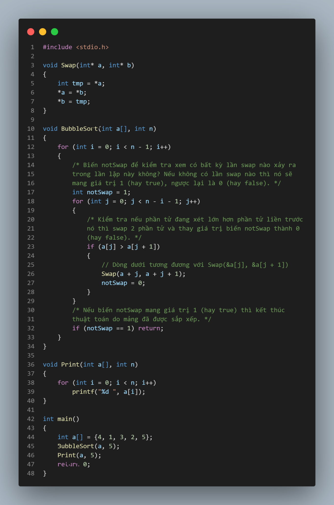

-   [**Một số thuật toán sắp xếp khác.**](https://www.geeksforgeeks.org/time-complexities-of-all-sorting-algorithms/)

# Thuật toán tìm kiếm cơ bản

## Tìm kiếm tuần tự (Linear Search)

-   Tư tưởng: Duyệt từ đầu mảng đến cuối mảng, nếu phần tử đang xét bằng với phần tử cần tìm thì ta trả về kết quả là chỉ số của nó.
-   Code:

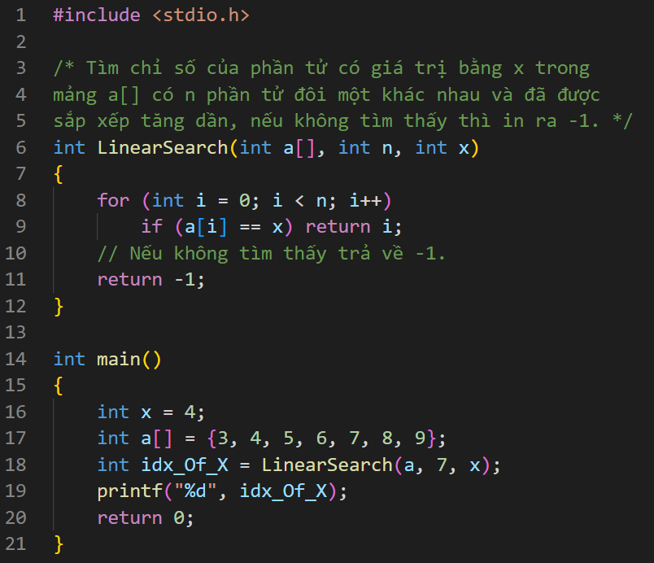

## Tìm kiếm nhị phân (Binary Search)

### Tư tưởng:

-   Với ai là số ở vị trí giữa mảng thì:
    -   Nếu x = ai thì ta tìm thấy ngay x.
    -   Nếu x \< ai thì x chỉ có thể xuất hiện trong đoạn [a0, ai – 1].
    -   Nếu x \> ai thì x chỉ có thể xuất hiện trong đoạn [ai + 1, an – 1].
-   Tại mỗi bước, ta so sánh x với phần tử đứng giữa trong đoạn đang tìm kiếm, dựa vào kết quả so sánh này mà ta quyết định giới hạn dãy tìm kiếm ở nửa dưới hay nửa trên của dãy tìm kiếm hiện hành.
-   **Lưu ý:** Chỉ sử dụng tìm kiếm nhị phân trong trường hợp mảng đã được sắp xếp, nếu không sẽ dẫn đến kết quả sai. Trường hợp mình làm dưới đây là trường hợp mảng được sắp xếp theo thứ tự tăng dần, còn trường hợp ngược lại thì các bạn sau khi đọc xong hay thử làm nhé!

### Thuật toán

-   Do tính chất mảng đã sắp xếp, công việc tìm kiếm phần tử x có thể triển khai như sau:
    -   Xét đoạn mảng a[left … right] cần tìm kiếm phần tử x. Ta so sánh x với phần tử ở vị trí giữa của mảng (mid = (left + right) / 2). Nếu:
        -   a[mid] = x đưa ra kết quả và thoát chương trình.
        -   a[mid] \< x thì cập nhật left = mid + 1, tức là thực hiện tìm kiếm trên đoạn a[mid + 1 … right].
        -   a[mid] \> x thì cập nhật right = mid – 1, tức là thực hiện tìm kiếm trên đoạn a[left … mid – 1].
    -   Thực hiện liên tục, nếu đến khi left \> right vẫn chưa tìm được thì dừng lại và kết luận không có phần tử nào trong mảng a[] bằng với x.
-   Code:

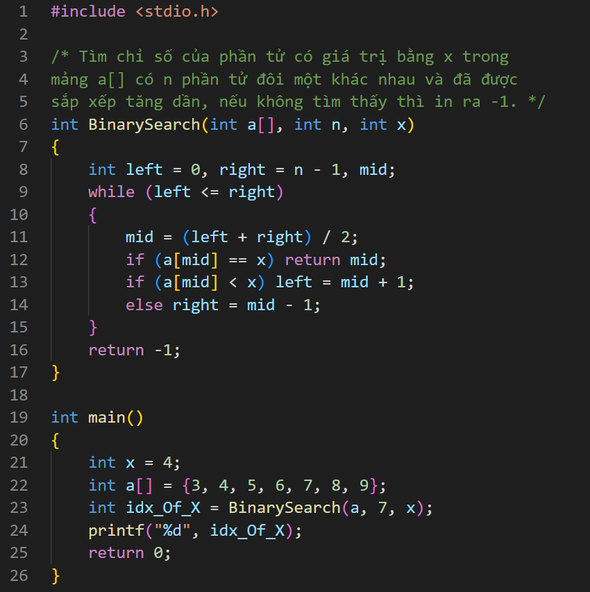

### Minh họa thuật toán:

-   **Đề bài:** Tìm x = 4 trong mảng đang được sắp xếp tăng dần bên dưới

-   B1: Xác định **left = 0** và **right = 6** trên mảng đang xét

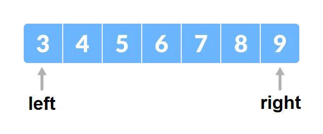

-   B2: Xác định được **mid = (left + right) / 2 = 3** trong mảng đang xét và **a[mid] = 6**.

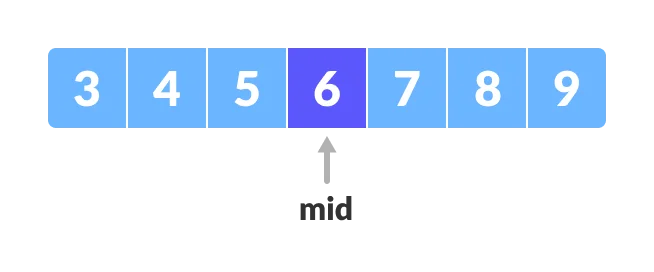

-   B3: Giá trị **x = 4** **nhỏ hơn a[mid] = 6** nên **right = mid – 1 = 2**, left vẫn là 0. Mảng con đang xét hiện tại là a[left], …, a[right] hay a[0], …, a[2].

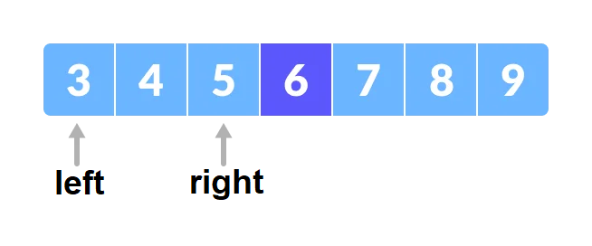

-   B4: Xác định lại **mid = (left + right) / 2 = 1** và **a[mid] = 4**.

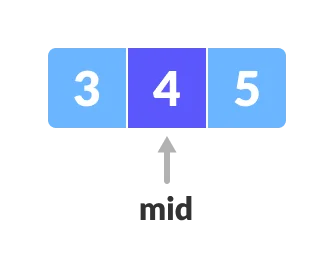

-   B5: Tìm được **x = 4** tại chỉ số là 1.

![Tìm thấy x = a[mid]](media/08b86e505f40f737accd92355200450b.png)

## So sánh giữa thuật toán tìm kiếm tuần tự và thuật toán tìm kiếm nhị phân:

-   Trong đa số các trường hợp thì tìm kiếm nhị phân **nhanh hơn rất nhiều** so với tìm kiếm tuần tự, tuy nhiên có một nhược điểm của tìm kiếm nhị phân đó là yêu cầu mảng đó phải được sắp xếp.

-   Như minh họa trên ta có thể thấy sử dụng **tìm kiếm nhị phân** chỉ tốn **3 bước** (dù đây là trường hợp xấu nhất của tìm kiếm nhị phân) trong khi đó **tìm kiếm tuần tự** mất tới **11 bước!!**
