**C - Buổi 5: Mảng đa chiều. Con trỏ và quyền năng của nó**

Kiến thức buổi 5:

[I. Mảng đa chiều](#mảng-đa-chiều)

[II. Con trỏ và quyền năng của nó](#con-trỏ-pointer-và-quyền-năng-của-nó)

# Mảng đa chiều

## Giới thiệu

-   **Mảng đa chiều** là một cấu trúc dữ liệu quan trọng. Với mảng đa chiều, chúng ta thường chỉ sử dụng đến mảng 2 chiều (Ma trận) và đôi khi sử dụng mảng 3 chiều.

## Định nghĩa

-   **Mảng đa chiều (Multi-dimensional array)** là một mảng của các mảng. **Mảng 2 chiều hay ma trận** là mảng đa chiều thường được sử dụng nhất. Khi đó, mảng 2 chiều là một mảng của các mảng 1 chiều.
-   Giả sử mảng 1 chiều có n phần tử, nếu mỗi phần tử của mảng là 1 mảng 1 chiều =\> Ta có mảng 2 chiều.
-   Mảng 2 chiều có cách lưu trữ các phần tử giống như một bảng.

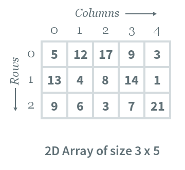

-   Cách truy cập tới phần tử của ma trận cũng giống như với mảng 1 chiều. Tuy nhiên, chúng ta sẽ có 2 chỉ số khác nhau là chỉ số hàng (row_index) và chỉ số cột (col_index). Cú pháp như sau: **arr[row_index][col_index]**.

## Sử dụng mảng 2 chiều

### Khai báo mảng 2 chiều

-   Để khai báo mảng 2 chiều, bạn phải chỉ định các tham số sau:
    -   **row-size:** Khai báo số hàng của mảng 2 chiều.
    -   **column-size:** Khai báo số cột của mảng 2 chiều.
    -   **Type of array:** Kiểu dữ liệu của mảng 2 chiều. Việc này chỉ định kiểu dữ liệu của các phần tử trong mảng; là số nguyên, số thực, ký tự hay là kiểu dữ liệu nào đó.
-   Cú pháp khai báo mảng 2 chiều có dạng:

         <Kiểu dữ liệu> <Tên mảng>[<Số hàng>][<Số cột>];

-   Ví dụ: int arr[5][6];

### Khởi tạo mảng 2 chiều

-   Giống như mảng 1 chiều, mảng 2 chiều cũng có thể khởi tạo trong quá trình khai báo hoặc khởi tạo sau khi khai báo.
-   Cú pháp khởi tạo mảng 2 chiều trong khi khai báo như sau:

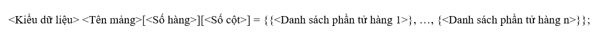

hoặc

\<Kiểu dữ liệu\> \<Tên mảng\>[\<Số hàng\>][\<Số cột\>] = {\<Danh sách các phần tử\>};

-	Ví dụ:
    +	int arr[2][3] = {{2, 4, 6}, {3, 5, 7}};  
        hoặc arr[2][3] = {
                                    {2, 4, 6},
                                    {3, 5, 7}
                                }; 
        hoặc int arr[2][3] = {2, 4, 6, 3, 5, 7};
+	Khi đó mảng a sẽ là ma trận 2 x 3:
    
        | 2 | 4 | 6 |
        |---|---|---|
        | 3 | 5 | 7 |

-   Với cách khởi tạo mảng 2 chiều sau khi khai báo, sử dụng chỉ số để truy cập tới từng ô của mảng, chúng ta có cú pháp như sau:
-   int arr[2][2];

    a[0][0] = 6;

    a[0][1] = 9;

    a[1][0] = 7;

    a[1][1] = 2;

-   Khi đó mảng a sẽ là ma trận 2 x 2:

        | 6 | 9 |
        |---|---|
        | 7 | 2 |

-   Lưu ý: Mảng 2 chiều có kích thước n x m thì chỉ số của hàng là từ 0 đến n – 1, của cột là từ 0 đến m – 1.

### Các thao tác với mảng 2 chiều

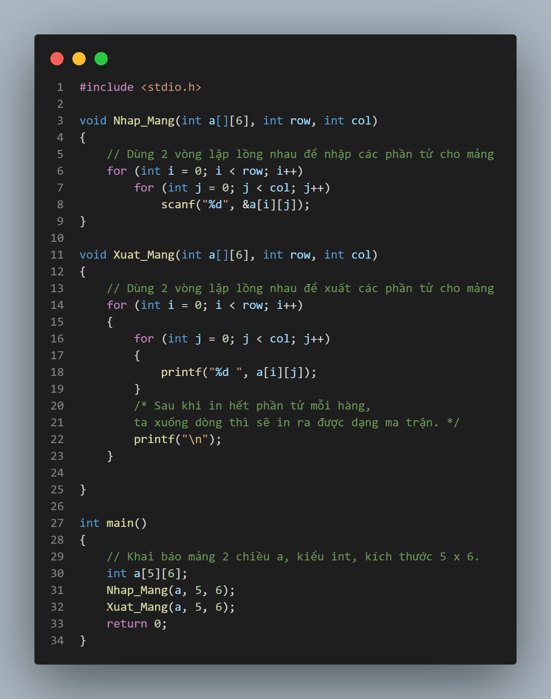

# Con trỏ (Pointer) và quyền năng của nó

Trước khi vào phần này thì các bạn cần nắm rõ cho mình về 2 toán tử sau:

| **Biểu tượng** | **Mô tả**                         |
|----------------|-----------------------------------|
| **&**          | Xác định địa chỉ của một biến.    |
| **\***         | Truy cập đến giá trị của địa chỉ. |

## Tìm hiểu địa chỉ ô nhớ trong C

-   Trước khi tìm hiểu khái niệm con trỏ trong C, ta sẽ điểm qua một vài thông tin của địa chỉ biến nhớ trước. Đầu tiên ta sẽ nhìn qua ví dụ sau:

    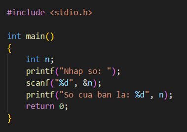

-   Bạn có thể thấy rằng khi dùng hàm scanf, để truyền biến number ta cần dùng dấu &. Còn đối với hàm printf thì lại không cần. Lý do ở đây là gì? Câu trả lời là vì scanf cần giá trị của biến, vì thế dấu & sẽ giúp nó định vị được địa chỉ của biến đó.

    

-   Từ đó ta rút ra được kết luận: Mỗi biến đều được đính kèm địa chỉ của nó và giá trị nó đang lưu trữ. Để xác định được địa chỉ của biến, ta chỉ cần thêm dấu & đằng trước nó.
    -   Ví dụ:

        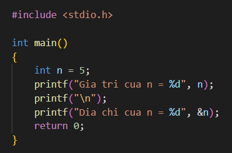

    -   Ta sẽ nhận được kết quả trả về là:

        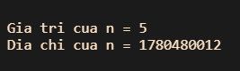

-   Chú ý:
    -   Kết quả ở mỗi máy có thể khác nhau do thông số không giống nhau.
    -   Nếu bạn muốn nhận địa chỉ là hexa như đầu bài, hãy thay thế %d bằng %x.

        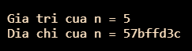

## Con trỏ trong C

### Định nghĩa

-   **Con trỏ** là **biến trỏ tới địa chỉ** hay nói cách khác là nó **mang giá trị** là một **địa chỉ.**
-   **Con trỏ** cũng là một **biến** nên nó cũng có thể khai báo, khởi tạo, lưu trữ giá trị và địa chỉ của riêng nó.
-   Chính vì con trỏ mang địa chỉ, nó là 1 biến đặc biệt có thêm những **quyền năng** mà biến bình thường không có. Nhờ việc nó mang địa chỉ, nó có thể **trỏ lung tung** trong bộ nhớ. Đây là 1 **điểm mạnh** nếu ta **khai thác tốt** nhưng nếu **quản lý không tốt** thì lại là 1 **tai hại**.

### Cách khai báo con trỏ

-   Cú pháp: \<Kiểu dữ liệu\>\* \<Tên con trỏ\>;
-   Trong đó:
    -   Kiểu dữ liệu có thể là: void, int, float, double,…
    -   Dấu \* trước tên biến là ký hiệu báo cho trình biên dịch biết ta đang khai báo con trỏ.
    -   Ví dụ: int\* p;
    -   Chúng ta cần thống nhất một số khái niệm khi làm việc với con trỏ:
        -   **Kiểu dữ liệu của con trỏ:** Kiểu dữ liệu của con trỏ trùng với kiểu dữ liệu tại vùng nhớ mà nó trỏ đến.
        -   **Giá trị của con trỏ:** địa chỉ mà con trỏ trỏ đến.
        -   **Địa chỉ của con trỏ:** địa chỉ của bản thân biến con trỏ đó.

### Gán giá trị cho con trỏ

-   Vì con trỏ là biến mang giá trị là 1 địa chỉ nên khi gán giá trị cho con trỏ ta phải gán giá trị cho nó là 1 **địa chỉ.**
-   Để lấy địa chỉ của 1 biến, ta sử dụng toán tử &.
-   Để lấy giá trị tại 1 địa chỉ ta sử dụng toán tử \*.

    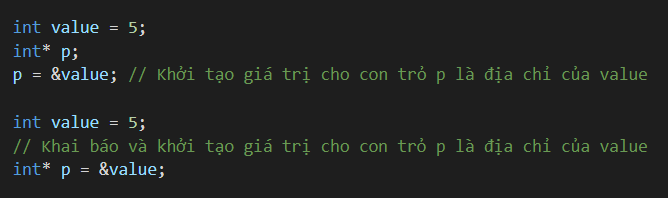

    Hoặc bạn cũng có thể khai báo và khởi tạo đồng thời:

    

-   **Lưu ý:**
    -   Sau khi khai báo con trỏ, bạn cần khởi tạo giá trị cho nó. Nếu con trỏ được sử dụng mà không được khởi tạo, giá trị của nó sẽ là giá trị rác, điều này sẽ làm chương trình của bạn chạy không đúng, thậm chí là nguy hiểm nếu giá trị rác đó chẳng may lại chính là địa chỉ của 1 biến nào đó bạn đang dùng.
    -   Khởi tạo con trỏ bằng địa chỉ NULL nếu chưa cần dùng theo cách sau: int\* p = NULL. Khi đó con trỏ NULL luôn có giá trị 0.

### Thấu hiểu con trỏ trong C

-   Bạn sẽ hiểu rõ hơn các quyền năng của con trỏ trong phần này, cùng xem ví dụ dưới đây nhé:

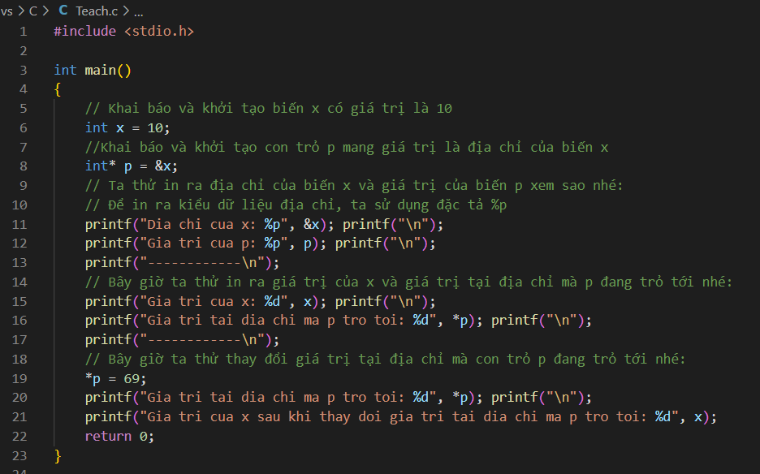

-   Kết quả:

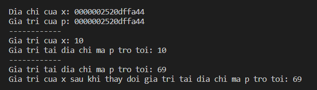

-   Nhận xét:
    -   Địa chỉ của biến **x** chính là giá trị của con trỏ **p**, đều là 0000002520dffa44. Lưu ý, mỗi lần chạy thì giá trị địa chỉ này có thể khác nhau nhé.
    -   Con trỏ có thể **lấy giá trị** của biến mà nó đang trỏ tới bằng toán tử **\***: printf("Gia tri tai dia chi ma p tro toi: %d", \*p); (Dòng 16)
    -   Con trỏ có thể **thay đổi giá trị** của biến mà nó đang trỏ tới. Do nó mang địa chỉ của biến, khi đó nó hoàn toàn có quyền thay đổi giá trị của biến đó. Như ví dụ ở trên ta thay đổi giá trị của x từ 10 lên 69.

### Các lỗi thường gặp khi làm việc với con trỏ

-   Giả sử bạn muốn khởi tạo giá trị của con trỏ p trỏ tới địa chỉ của biến x, khi đó:

    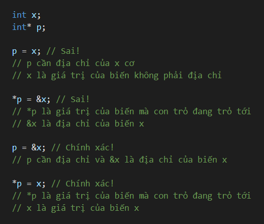

-   Các bạn mới học con trỏ sẽ mông lung về dấu \* ở phần khai báo và khi lấy giá trị của biến mà con trỏ đang trỏ tới:

    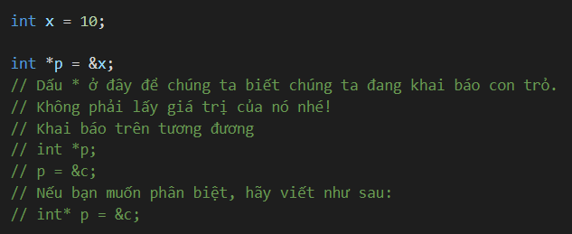

## Hàm và con trỏ

-   Phần này thì mình đã từng nói trong phần **5.3 Truyền tham số bằng con trỏ** trong **Buổi số 3**, các bạn sau khi đọc và hiểu xong phần về con trỏ ở trên có thể mở lại đoạn đó, đọc và ngẫm nha! Nếu ngẫm được phần này thì sẽ rất tốt cho bạn đó 😘. Nếu bạn không ngẫm ra được cũng không sao vì phần này là một phần rất khó. Và nếu bạn không chê thì có thể đọc phần giải thích của mình 😁.

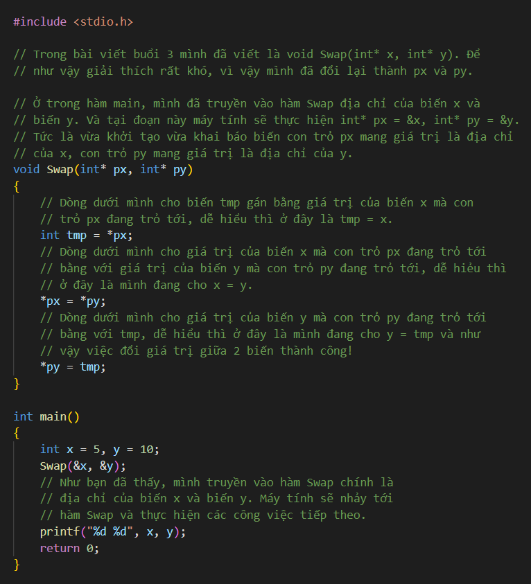

-   Đúng như những gì đã trình bày rõ ràng phần về con trỏ, khi ta có địa chỉ của biến (con trỏ lưu) thì ta có thể thay đổi giá trị của biến mà con trỏ đang trỏ tới. Đó chính là cách truyền con trỏ vào hàm trong C.
-   Trong ví dụ trên, chúng ta truyền địa chỉ của x và y vào con trỏ px và py. Vì ta truyền con trỏ nên giá trị của x và y trong hàm main() sẽ bị thay đổi.

## Mảng và con trỏ

### Các phần tử của mảng là các ô nhớ liên tiếp

-   Nhắc lại khái niệm về mảng: *Mảng là một tập hợp tuần tự các phần tử có cùng kiểu dữ liệu và các phần tử được lưu trữ trong một dãy* **các ô nhớ liên tục** *trên bộ nhớ.*
-   Các bạn đặc biệt lưu ý tới tính chất được lưu trên các ô nhớ liên tục, bây giờ chúng ta sẽ chứng minh tính đúng đắn của nó bằng ví dụ dưới đây:

    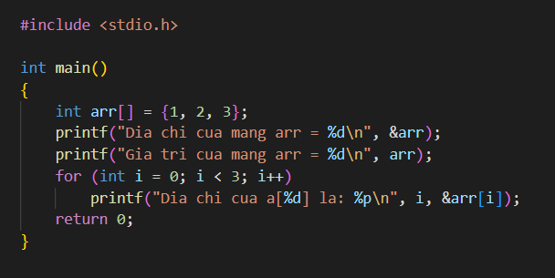

    -   Kết quả:

        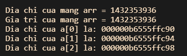

-   Nhận xét:
    -   Các phần tử liên tiếp có địa chỉ cách nhau **4 đơn vị**, bởi vì 1 phần tử kiểu **int** có **kích thước 4 bytes** (máy tính x64). Nên ta chắc chắn các phần tử mảng được **xếp cạnh nhau** trong bộ nhớ.
    -   Một điều đặc biệt nữa, như mình có nói là khi **truyền mảng vào hàm** thì mặc định là **truyền theo tham chiếu**. Và trong ví dụ này bạn thấy đó, **địa chỉ của biến mảng** chính là **địa chỉ của phần tử đầu tiên của mảng**. Và **giá trị của biến mảng** cũng chính là **địa chỉ** của **phần tử đầu tiên** của mảng.
    -   Như vậy, **\&arr[0]** tương đương **\&arr** và tương đương **arr.** Điều đó có được là do biến **arr trỏ tới phần tử đầu tiên** của mảng.

### Toán tử tăng và giảm của con trỏ

-   Chỉ sử dụng được các toán tử cộng và trừ trên con trỏ.

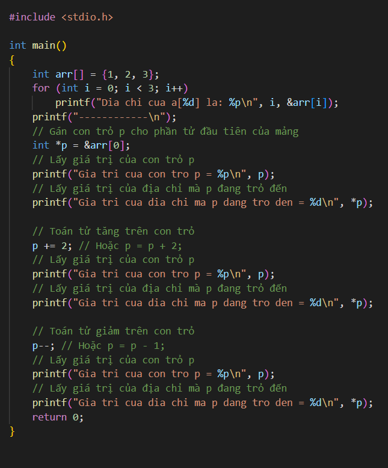

-   Kết quả:

    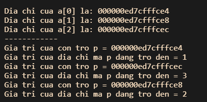

    -   Như bạn thấy:
        -   Khi dùng toán tử tăng/ giảm trên biến con trỏ, nó sẽ nhảy sang ô nhớ liền kề chứ không phải tăng địa chỉ mà nó đang trỏ lên 1. Do con trỏ **p** là kiểu **int** nên mỗi bước tăng, giá trị của p tăng thêm **4 đơn vị**. (**Lưu ý:** giá trị của con trỏ là địa chỉ mà nó đang trỏ tới)
        -   Nếu bạn muốn tăng giá trị của địa chỉ nơi con trỏ đang trỏ tới, hãy dùng cách sau: **(\*p) += x;** (x là số bạn muốn cộng thêm). Các phép tính khác tương tự.

### Mối quan hệ giữa con trỏ và mảng trong C

-   Tới đây chắc hẳn bạn đã hình dung được sự liên hệ giữa con trỏ và mảng, mình sẽ cùng các bạn đi tới các kết luận về con trỏ và mảng nhé.

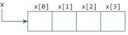

-   Với mảng trong ảnh phía trên, ta có:
    -   **\&x[0]** và **x** có cùng giá trị, và **x[0]** hay **\*x** là tương đương nhau.
    -   **\&x[1]** tương đương với **x+1** và **x[1]** tương đương với **\*(x+1).**
    -   **\&x[2]** tương đương với **x+2** và **x[2]** tương đương với **\*(x+2).**
    -   …
    -   Tóm lại, **\&x[i]** tương đương với **x+i** và **x[i]** tương đương với **\*(x+i).**
