**C - Buổi 6: Chuỗi**

Kiến thức buổi 6: Only chuỗi

Bảng mã ASCII: [ASCII – Wikipedia tiếng Việt](https://vi.wikipedia.org/wiki/ASCII)

# Chuỗi (String)

## Chuỗi trong C

-   Chuỗi là một **tập hợp các ký tự (char)** được lưu trữ trên các ô nhớ liên tiếp và luôn luôn có 1 **ký tự null là \\0** báo hiệu kết thúc chuỗi.
-   Ví dụ: int c[] = “c string”;
-   Khi khai báo và khởi tạo chuỗi theo cách trên, trình biên dịch sẽ **tự thêm 1 ký tự null \\0 vào cuối.**

        | c |   | s | t | r | i | n | g | \\0 |

-   Như vậy, nếu bạn muốn khai báo chuỗi để lưu **n** ký tự, bạn cần mảng ký tự có kích thước tối đa ít nhất là **n+1**.
-   Khi in thì sẽ chỉ in đến ký tự \\0 mà thôi
-   Ví dụ:  
    Anh Hao\\0 =\> Anh Hao  
    Anh\\0 Tu =\> Anh

## Cách khởi tạo giá trị cho chuỗi

-   Bạn có thể khởi tạo giá trị cho chuỗi theo 1 trong các cách dưới đây:
    -   char c[] = "abcd";
    -   char c[50] = "abcd";
    -   char c[] = {'a', 'b', 'c', 'd', '\\0'};
    -   char c[5] = {'a', 'b', 'c', 'd', '\\0'};
-   Nhưng **không được làm** như sau: char c[5] = "abcde";
    -   Bởi vì chuỗi của bạn có **5 ký tự** cộng thêm **1 ký tự \\0** là **6**, sẽ bị **vượt quá kích thước tối đa.**

## Nhập xuất chuỗi

-   Để **nhập** một chuỗi ký tự từ bàn phím, ta có rất nhiều cách:
    -   **gets(\<Biến chuỗi\>);** : Lấy cả chuỗi.
    -   **scanf(“%s”, \<Biến chuỗi\>);** : Chi nhập được một chuỗi không có dấu khoảng trắng, tức là chỉ lấy được 1 từ.
    -   **fgets(\<Biến chuỗi\>, \<Số ký tự muốn đọc\>, \<Tên file\>);** : Đây là hàm đọc chuỗi từ file, để đọc chuỗi từ bàn phím ta để \<Tên file\> là stdin (standard input). Nếu nhập không hết \<Số ký tự muốn đọc\> thì nó sẽ đọc cả **\\n.**
-   Và để **in** ra thì cũng không thiếu cách:
    -   **printf(“%s”, \<Biến chuỗi\>);** : in ra 1 chuỗi.
    -   **puts(\<Biến chuỗi\>);** : in thêm 1 dấu **\\n** ở cuối.
-   Ví dụ:

    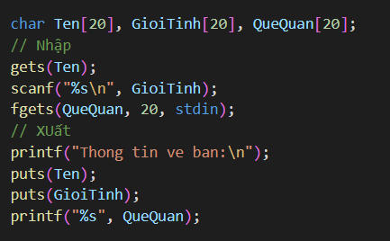

-   **Lưu ý:**
    -   Nếu xảy ra TH chương trình bỏ qua bước nhập chuỗi, hiện tượng này xảy ra khi trước đó đã nhập vào 1 biến số nào đó, điều đó khiến bộ nhớ đệm còn lưu lại kí tự **\\n.**
    -   **Cách giải quyết:**
        -   Dùng thêm hàm **fflush(stdin)** để xóa bộ nhớ đệm khi dùng **gets() hoặc fgets()** ở giữa các lần sử dụng **scanf().**
        -   Hoặc là có thể viết: **scanf(“\<Danh sách đặc tả\>\\n”, \<Danh sách tham số\>);.** Ví dụ scanf(“%d\\n”, \&x);

## Mảng ký tự 2 chiều

-   **Mảng chuỗi 2 chiều trong c**, hay còn gọi là *mảng ký tự 2 chiều trong c* hoặc là *mảng char 2 chiều trong c*, là loại mảng 2 chiều với các **phần tử của mảng đều có chung kiểu char**, và được sử dụng để **lưu giữ nhiều chuỗi ký tự cùng lúc trong cùng một mảng.**

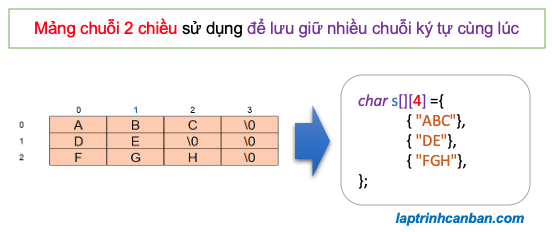

-   Trong các phần trên, chúng ta đã biết chuỗi ký tự trong C thực chất là 1 mảng 1 chiều chứa các ký tự thuộc kiểu char. Điều đó có nghĩa, **1 mảng 1 chiều chỉ có thể chứa tối đa 1 chuỗi ký tự duy nhất** trong nó mà thôi.
-   Trong trường hợp cần **lưu giữ nhiều chuỗi ký tự trong 1 mảng**, thay vì sử dụng mảng 1 chiều thì chúng ta sẽ sử dụng tới **mảng chuỗi 2 chiều trong c** để lưu giữ cùng lúc nhiều chuỗi ký tự trong cùng một mảng.
-   **Ví dụ**, 1 chuỗi ký tự trong C được lưu giữ vào biến dưới dạng mảng chuỗi 1 chiều như sau: char s[] = “ABC”;
    -   **Lưu ý:** là chuỗi ký tự luôn được **kết thúc bởi ký tự \\0**, nên trong chuỗi trên có **3 ký tự**, cộng thêm cả ký tự kết thúc chuỗi \\0 nữa nên độ dài (số ký tự) trong chuỗi sẽ là **4**, chứ không phải là 3 nhé.
-   Trong trường hợp chúng ta **cần lưu giữ nhiều chuỗi ký tự** như trên trong cùng 1 biến, thay vì sử dụng mảng chuỗi 1 chiều thì chúng ta sẽ **sử dụng mảng 2 chiều**. Do mỗi **mảng 1 chiều** sẽ biểu diễn **1 chuỗi ký tự**, nên khi đặt các mảng 1 chiều này vào trong một **mảng chuỗi 2 chiều**, chúng ta sẽ chỉ cần **1 mảng chuỗi 2 chiều duy nhất** để biểu diễn **toàn bộ các chuỗi** mà thôi.
-   **Ví dụ cụ thể:**

    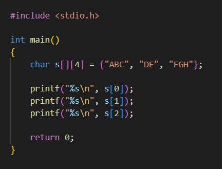

-   **Kết quả:**

    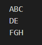

-   Và mảng chuỗi 2 chiều trên được biểu diễn dưới dạng bảng như sau:

    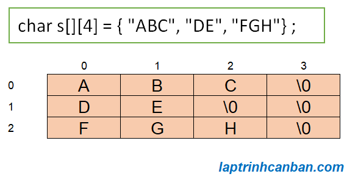

-   Khởi tạo, nhập xuất mảng ký tự 2 chiều tương tự như mảng số nguyên 2 chiều.

## Một số hàm xử lý chuỗi

Có rất nhiều phương thức xử lý chuỗi quan trọng được định nghĩa trong thư viện **\<string.h\>.**

Những hàm này bản thân bạn **hoàn toàn có thể viết được** và các bạn **nên thử tự mình viết**. Còn nếu cần sử dụng thường xuyên thì C có sẵn rồi nên là mình dùng luôn cho tiện, tội gì đúng không =))

### Hàm strlen(): Xác định độ dài chuỗi

-   Cú pháp: strlen(str);

    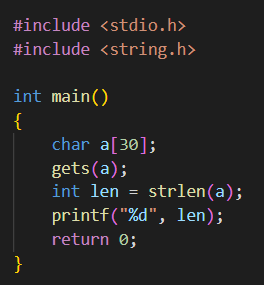

    -   **Kết quả:**

        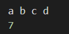

### Hàm strcat(): Nối chuỗi

-   Cú pháp: strcat(str1, str2);
-   Hàm này có tác dụng **ghép chuỗi** nguồn (str2) vào chuỗi đích (str1).

    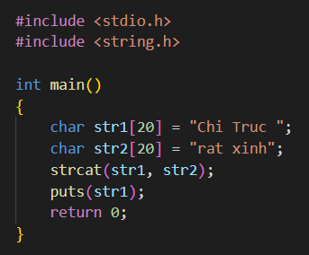

-   **Kết quả**

    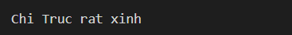

### Hàm strcpy(): Gán chuỗi cho chuỗi

-   Cú pháp: strcpy(str1, str2);
    -   Ngôn ngữ C **không cho phép ta gán trực tiếp** chuỗi cho chuỗi thông qua toán tử (=) vì chuỗi là mảng ký tự.
        -   Hàm strcpy() sẽ **gán giá trị** của chuỗi str2 cho chuỗi str1.

            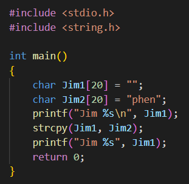

            -   Kết quả:

                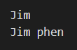

### Hàm strchr(): Tìm ký tự trong chuỗi

-   Cú pháp: strchr(str, chr);
-   Trong đó: str là chuỗi, chr là biến ký tự.
-   Cách hoạt động của hàm này: Nó sẽ tìm xem trong chuỗi **str** có ký tự **chr** hay ko, nếu có thì hàm **trả về chuỗi bắt đầu từ vị trí đầu tiên tìm thấy kí tự chr** cho đến hết chuỗi str, Ngược lại thì trả về **NULL**.

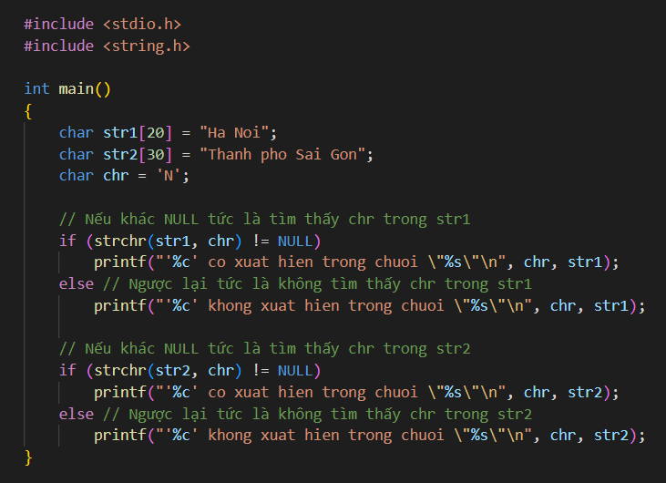

-   **Kết quả:**

    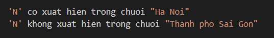

### Hàm strcmp(): So sánh 2 chuỗi

-   Cú pháp: strcmp(str1, str2);
-   **So sánh** với tiêu chí là **thứ tự ký tự** trong **bảng mã ASCII**.
-   Hàm sẽ trả về một số chính là hiệu của hai ký tự cuối cùng đem so sánh. Cụ thể hàm sẽ trả về giá trị theo các TH sau:
    -   **Trả về một số âm (\<0)** nếu chuỗi s1 **nhỏ hơn** chuỗi s2.
        -   **Trả về 0** nếu chuỗi s1 **giống** hệt chuối s2.
        -   **Trả về một số dương (\>0)** nếu chuỗi s1 **lớn hơn** chuỗi s2.
-   **Ví dụ**:
    -   Chuỗi **"abc"** **nhỏ hơn** chuỗi **"abd",** vì ký tự **'d'** có **vị trí lớn hơn** ký tự **'c'** trong **bảng mã ASCII.**
    -   Chuỗi **"abc"** **nhỏ hơn** chuỗi **"abcd".**
    -   Chuỗi **"An"** **nhỏ hơn** chuỗi **"Anh",** chuỗi "**Anh**" nhỏ hơn chuỗi **"Binh".**

**3 hàm sau hiện tại đã không còn dùng được nữa!!**

### Hàm strlwr(): Chuyển chuỗi thành in thường

-   Cú pháp: strlwr(str);
    -   **Ví dụ:** strlwr(“ABC”); thành “abc”.

### Hàm strupr(): Chuyển chuỗi thành in hoa

-   Cú pháp: strupr(str);
    -   **Ví dụ:** strupr(“abc”); thành “ABC”.

### Hàm strrev(): Đảo ngược chuỗi

-   Cú pháp: strrev(str);
    -   **Ví dụ:** strrev(“Hello”); thì kết quả là “olleH”;

### Bảng tóm tắt các hàm:

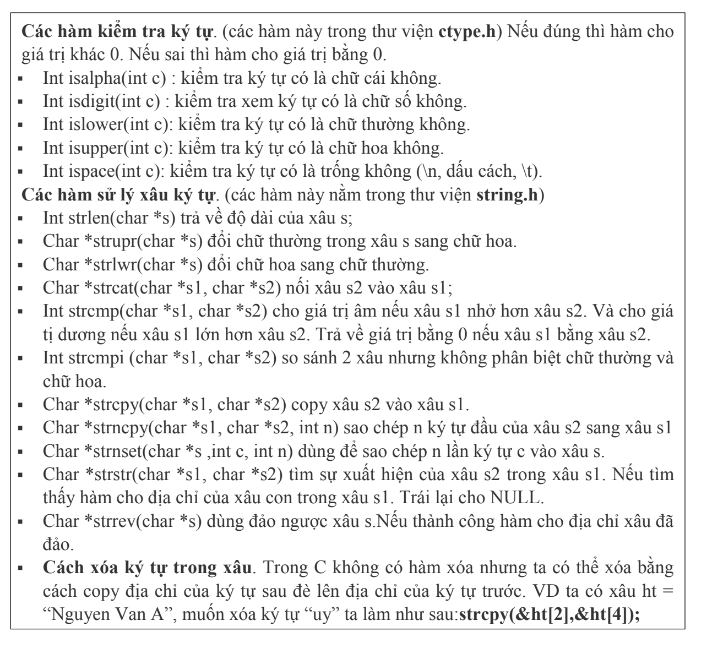

## Tách chuỗi trong C

### Cú pháp

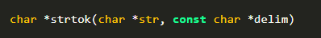

-   **Trong đó:**
    -   **str:** Nội dung của chuỗi này được sửa đổi và được chia thành các chuỗi nhỏ hơn (các token).
    -   **delim:** Đây là chuỗi chứa Delimiter (chỉ các dấu phân tách). Chúng có thể rất đa dạng tùy vào từng lời gọi.

### Trả về giá trị

-   Hàm strtok() sẽ trả về **vị trí đầu chuỗi** của **chuỗi con đầu tiên** được **phân tách bằng ký tự phân tách** từ chuỗi ban đầu dưới dạng con trỏ chuỗi trong C. Trong trường hợp không tìm thấy **ký tự phân tách** , giá trị **NULL** sẽ được trả về.
-   Cơ chế của hàm strtok() là **điền ký tự kết thúc chuỗi \\0 vào chuỗi ban đầu** mỗi khi tìm thấy ký tự phân tách, do đó cần lưu ý là hàm strtok() sẽ **làm biến đổi** chuỗi ban đầu.
-   Hàm strtok() chỉ có thể **tách một chuỗi con bằng dấu phân tách** từ chuỗi ban đầu trong **mỗi lần thực thi** mà thôi.
    -   Ví dụ:

        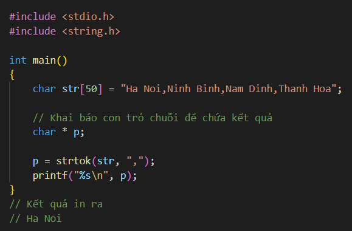

    -   Ở ví dụ này, hàm strtok() sẽ hoạt động với các bước như sau:
        -   **B1:** Hàm strtok() bắt đầu **tìm vị trí ký tự phân tách là dấu ,** ở bên trong chuỗi str.
        -   **B2:** Sau khi tìm thấy vị trí dấu phẩy đầu tiên, hàm strtok() sẽ **điền ký tự kết thúc chuỗi \\0 vào vị trí tìm thấy**. Khi đó, chuỗi ban đầu sẽ **chuyển thành dạng “Ha Noi\\0Ninh Binh,Nam Dinh,Thanh Hoa”.**
        -   **B3:** Hàm strtok() **quay trở về đầu chuỗi ban đầu** và **trả về vị trí đầu chuỗi** này dưới dạng con trỏ chuỗi trong C. Cuối cùng khi in con trỏ chuỗi này, chuỗi sẽ được in ra từ vị trí đầu chuỗi là ký tự H cho đến ký tự thúc chuỗi \\0 (Ha Noi\\0), do đó chuỗi kết quả Ha Noi sẽ được in ra màn hình.

### Tách toàn bộ chuỗi

-   Ở phần trên chúng ta đã biết hàm strtok() trong C **chỉ có thể giúp chúng ta tách một chuỗi con** bằng dấu phân tách từ chuỗi ban đầu trong mỗi lần sử dụng mà thôi.
-   Do đó, để có thể **tách toàn bộ chuỗi con** từ chuỗi ban đầu trong C thì sau lần tách đầu tiên, chúng ta cần phải **tạo ra một vòng lặp để lần lượt tách các chuỗi con** còn lại từ chuỗi ban đầu bằng hàm strtok().
-   Và lựa chọn sáng giá ở đây chính là **vòng lặp while**, khi mà chúng ta vốn **không biết rõ số vòng lặp cần dùng là bao nhiêu** trong chương trình.
-   Chúng ta sẽ viết chương trình tách toàn bộ chuỗi con từ chuỗi trong c như sau:

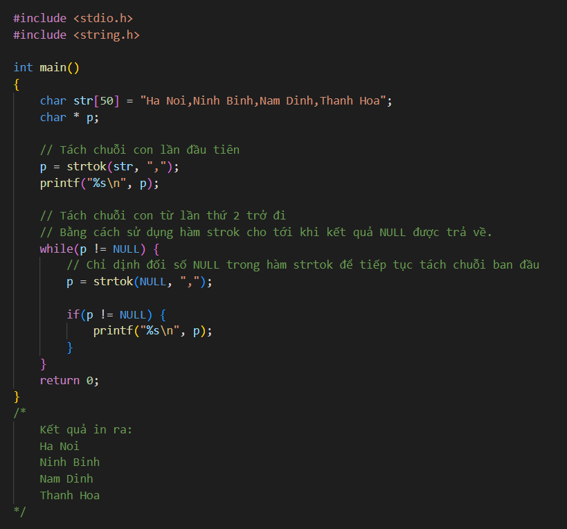

-   Ở đây chúng ta cần phải **lưu ý rằng:** Lần gọi hàm strtok() **đầu tiên** và **các lần tiếp theo** là **khác nhau. Cụ thể:**
    -   Trong lần gọi strtok **đầu tiên**, chúng ta phải **chỉ định đối số của hàm là chuỗi ban đầu** để bắt đầu tách chuỗi. Trong các lần gọi **tiếp theo,** chúng ta phải **chỉ định NULL làm đối số của hàm**. Đối số này sẽ **yêu cầu hàm tiếp tục tách từ chuỗi ban đầu** đã truyền vào từ trước đó. Nếu chúng ta **chỉ định lại chuỗi ban đầu hoặc một chuỗi khác** thì kết quả hàm sẽ **không tiếp tục tách nữa** mà sẽ bắt đầu **xử lý lại từ đầu**.
    -   Khi **không còn tìm thấy ký tự phân tách từ** trong chuỗi ban đầu nữa, **kết quả NULL sẽ được trả về**, và khi đó thì **vòng lặp While sẽ kết thúc.**
-   Chúng ta không nhất thiết **chỉ chỉ định một ký tự làm ký tự phân tách, mà có thể chỉ định nhiều ký tự**. Ví dụ như chúng ta có thể phân tách dấu phẩy dấu cách dấu chấm cùng nhau:

    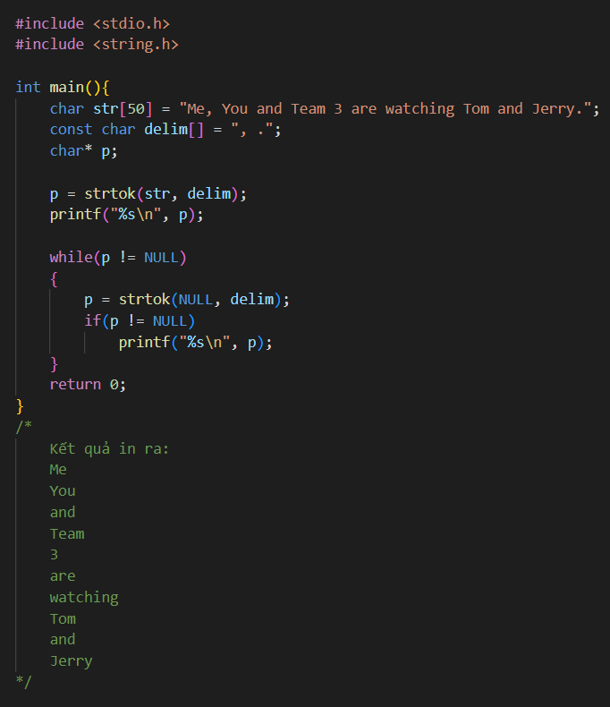

## Một số hàm chất chơi liên quan đến chuỗi trong thư viện stdlib.h

Những hàm này bản thân bạn **hoàn toàn có thể viết được** và các bạn **nên thử tự mình viết**. Còn nếu cần sử dụng thường xuyên thì C có sẵn rồi nên là mình dùng luôn cho tiện, tội gì đúng không =))

### Hàm itoa, ltoa: Chuyển tử số sang chuỗi

-   Vì itoa (dành cho kiểu int) và ltoa (dành cho kiểu long) tương tự nhau nên mình sẽ chỉ trình bày itoa.
    -   Sử dụng hàm itoa trong thư viện stdlib.h. Được sử dụng vô cùng nhiều trong việc chuyển kiểu int sang string trong c. Với những câu lệnh đơn giản giúp bạn tối ưu được code của mình.

        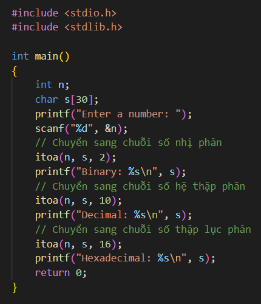

        -   Kết quả:

            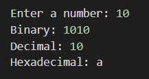

### Hàm atoi, atol, atof: Chuyển từ chuỗi sang số

-   Vì atoi (trả về số kiểu int), atol (trả về số kiểu long) và atof(trả về số thực) là tương tự nhau nên mình sẽ chỉ trình bày atoi.
-   Hàm này nhận vào mảng có kiểu char[].
-   Nếu chuyển đổi không thành công, kết quả trả về của các hàm là 0.

    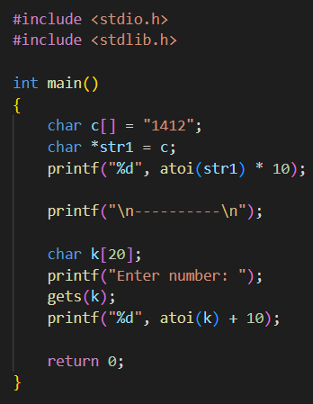

    -   Kết quả:

        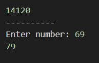

### Chuyển từ chuỗi sang số không dùng hàm (Bonus)

-   Giả sử, nếu bạn có một chuỗi string là 12345. Làm sao bạn chuyển thành số 12345 được.
    -   Mình phân tích một chút:   
        12345 = 5\*10\^0 + 4\*10\^1 + 3\*10\^2 + 2\*10\^3 + 1\*10\^4.  
        Ok, như vậy, bạn chỉ cần lấy từng ký tự từ cuối lên, và nhân với 10\^x, x sẽ tăng dần từ 0. Cộng tổng chúng lại là được kết quả rồi đấy.
        -   Hoặc là ta có thể làm kiểu:  
            (((((5 \* 10 + 4) \* 10) + 3) \* 10) + 2) \* 10 + 1 = 54321  
            Rồi đảo ngược chuỗi lại là được.
