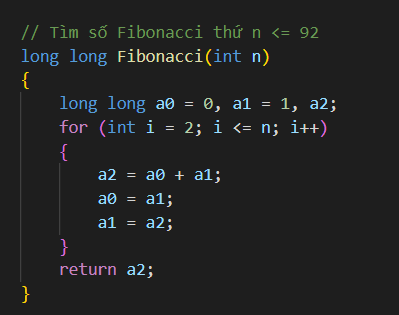

**C - Buổi 7 + 8: Một số kiến thức toán quan trọng trong lập trình**

Kiến thức buổi 7 + 8:

[I. Tiếp tục về số nguyên tố](#số-nguyên-tố-xem-thêm-ở-buổi-4)

[II. Ước chung lớn nhất và bội chung nhỏ nhất](#ước-chung-lớn-nhất-và-bội-chung-nhỏ-nhất)

[III. Số Fibonacci](#số-fibonacci)

[IV. Các hệ cơ số](#các-hệ-cơ-số)

[V. Toán tử bitwise](#bitwise)

[VI. Modulo](#modulo)

# Số nguyên tố (Xem thêm ở buổi 4)

## Phân tích thừa số nguyên tố

### Ý tưởng

-   Rất đơn giản, giả sử bạn cần phân tích số N thành tích các thừa số nguyên tố. Bạn chỉ cần thực hiện chia số N cho các số nguyên tố trong đoạn [2; N]. Với mỗi số nguyên tố đó, đếm số lần mà số N chia hết. Tất nhiên, sau mỗi lần chia cho số i, số N của chúng ta sẽ giảm đi i lần.
    -   Một ví dụ sinh động hơn, xét N = 300

-   Khi đó, 300 = 2\^2 \* 5\^2 \* 3. Nhưng không phải khi N = 1 chúng ta sẽ dừng đâu nhé. Xét một ví dụ khác xem sao:
    -   Giả sử N = 999, khi N chỉ còn 37, mà 37 là số nguyên tố, nên ta dừng quá trình chia.

-   Khi đó, 999 = 3\^3 \* 37.
    -   Nói một cách tổng quát hóa hơn, bạn sẽ dừng quá trình chia khi số chia lớn hơn N. Nói cách khác, chừng nào N chưa bằng 1, chúng ta tiếp tục quá trình chia.

### Code

Thời gian chạy O()

Or Sử dụng sàng nguyên tố O(log N)

## Sàng số nguyên tố trên đoạn

# Ước chung lớn nhất và bội chung nhỏ nhất

## Ước chung lớn nhất (GCD)

-   Giải thuật Euclid (hay thuật toán Euclid) là một giải thuật để tính ước chung lớn nhất (ƯCLN) của hai số nguyên, là số lớn nhất có thể chia được bởi hai số nguyên đó với số dư bằng không.
    -   Cho a, b là hai số nguyên (giả sử a ≥ b), để tìm ước chung lớn nhất của hai số a và b ta cần thực hiện chia a cho b được thương q và số dư r (r ≥ 0) tức là a = b\*q + r, khi đó ta có:

        

        -   Code:

Or đệ quy

## Bội chung nhỏ nhất (LCM)

-   Code:

## Tìm ước chung lớn nhất và bội chung nhỏ nhất của nhiều số

-   Để tìm ước chung lớn nhất của dãy số gồm N số (N ≥ 3), thực hiện như sau:
    -   Bước 1: Tìm ước chung lớn nhất của hai số đầu tiên T = GCD(a1​, a2​)
        -   Bước 2: Tiếp tục tìm GCD của a3​ với T rồi gán luôn vào T, sau đó tìm GCD của a4​ và T rồi gán vào T,... tiếp tục như vậy cho tới aN​. Ta có công thức tổng quát:   
            GCD(a1 ​, a2​, ..., aN​) = GCD(GCD(GCD(GCD(a1​,a2​),a3​),a4​,..),aN​)
            -   Đối với bội chung nhỏ nhất của N số, cách tìm hoàn toàn tương tự với ước chung lớn nhất. Cài đặt dưới đây sẽ tìm ước chung lớn nhất và bội chung nhỏ nhất của một dãy số a1​,a2​,...,aN​:

-   Chạy chương trình trên với dãy  *a*={12,8,10,4,6}, ta thu được kết quả là:  
    GCD of sequence is: 2  
    LCM of sequence is: 360

## Phi hàm Euler

### Nguyên tố cùng nhau

-   Là các số có ước chung lớn nhất là 1.

### Phi hàm Euler

-   ϕ(N) là số số nguyên tố cùng nhau với N trong đoạn từ 1 đến N.
    -   Ta đã biết **phân tích một số ra thừa số nguyên tố (factorization)** là biểu diễn số đó dưới dạng tích của các số nguyên tố.
        -   Từ cách phân tích một số ra thừa số nguyên tố, ta tính được phi hàm Euler của số đó (Thời gian chạy O()):

            

            -   Nói theo công thức:  
                ϕ(N)=n∗∏p\|n(1−1/p)
            -   Trong đó:
                -   p là các ước nguyên tố của n.
                -   ∏p\|n nghĩa là số mũ cao nhất của p mà n có thể chia hết.
            -   Ví dụ: ϕ(6)=6∗(1−1/2)∗(1−1/3)=2

# Số Fibonacci

## Giới thiệu

-   Fibonacci là dãy số kinh điển trong toán học được tìm thấy cách đây hơn 800 năm. Đến nay các nhà khoa học phát hiện nhiều trùng hợp thú vị về dãy số này trong tự nhiên.
-   Dãy Fibonacci là dãy vô hạn các số tự nhiên bắt đầu bằng 1 và 1, sau đó các số tiếp theo sẽ bằng tổng của 2 số liền trước nó.
-   Cụ thể, các số đầu tiên của dãy Fibonacci là 1, 1, 2, 3, 5, 8, 13, 21, 34, 55, 89, 144, 233, 377, 610…
-   Xem thêm hình minh họa dưới đây để hiểu thêm về dãy Fibonacci.

-   Sau đây sẽ là các cách tối ưu để tính dãy số này.

## Cách 1:

-   Lưu ý: n \<= 92

    

## Cách 2:

-   Lưu ý: n \<= 92

    

# Các hệ cơ số

Hệ đếm là một tập các ký hiệu (chữ số, chữ cái) để biểu diễn các số và xác định giá trị của các biểu diễn số. Mỗi hệ đếm gồm một tập hợp các ký số hữu hạn. Số lượng các ký số của mỗi hệ đếm gọi là cơ số.

Các hệ đếm cơ bản trong máy tính là:

    Hệ nhị phân (binary) – hệ 2

    Bát phân (octal) – hệ 8

    Hệ thập phân (decimal) – hệ 10

    Thập lục phân (hexadecimal) – hệ 16

## Nhị phân

-   Biểu diễn bởi 2 chữ số 0 và 1
-   Số nhị phân có dạng: A(2) = an an – 1 an - 2…a0
-   Giá trị A ở hệ cơ số 10 được tính như sau:  
    A(10) = an 2n + an - 1 2n - 1 +…+ a0 20
-   Ví dụ: 101(2) = 1.22 + 0.21 + 1.20 = 5(10)
-   Code chuyển về thập phân:

    

    Lưu ý: có thể dùng vòng for thay cho hàm pow.

## Bát phân

-   Biểu diễn bởi 8 chữ số 0, 1, 2, 3, 4, 5, 6, 7.
-   Số nhị phân có dạng: A(8) = an an – 1 an - 2…a0
-   Giá trị A ở hệ cơ số 10 được tính như sau:  
    A(10) = an 8n + an - 1 8n - 1 +…+ a0 80
    -   Ví dụ: 43(8) =4.81 + 3.80 = 5(10)
    -   Code chuyển về thập phân:

        

    Lưu ý: có thể dùng vòng for thay cho hàm pow.

## Thập lục phân

-   Biểu diễn bởi 16 chữ số 0, 1, 2, 3, 4, 5, 6, 7, 8, 9, A, B, C, D, E, F.
    -   A = 10, B = 11, C = 12, D = 13, E = 14, F = 15.
-   Số nhị phân có dạng: A(16) = an an – 1 an - 2…a0
-   Giá trị A ở hệ cơ số 10 được tính như sau:  
    A(10) = an 16n + an - 1 16n - 1 +…+ a0 160
-   Ví dụ:   
    19(16) =1.161 + 9.160 = 25(10)  
    1AB(16) = 1.162 + 10.161 + 11.160 = 427(10)
-   Code chuyển về thập phân:

    

    Lưu ý: có thể dùng vòng for thay cho hàm pow.

## Thập phân

-   **Đổi phần nguyên:** Lấy số nguyên thập phân N(10) lần lượt chia cho b cho đến khi thương số bằng 0. Kết quả số chuyển đổi M(b) là các số dư trong phép chia được viết ra theo thứ tự ngược lại.

-   Code:

-   **Đổi phần lẻ:** Lấy phần thập phân (sau dấu phẩy) N(10) lần lượt nhân với b cho đến khi phần thập phân của tích số bằng 0. Kết quả số chuyển đối M(b) là các số phần nguyên trong phép nhân được viết ra theo thứ tự phép tính.

## Bảng chuyển đổi

# Bitwise

Trước khi đi vào các bài tập ví dụ, chúng ta hãy ôn lại một chút kiến thức về các phép toán logic, bao gồm 6 phép toán cơ bản:

| **Toán tử** | **Ý nghĩa**        |
|-------------|--------------------|
| **&**       | AND                |
| **\|**      | OR                 |
| **\^**      | XOR                |
| **\~**      | NOT                |
| **\<\<**    | Dịch bit sang trái |
| **\>\>**    | Dịch bit sang phải |

## Các phép toán thao tác bit cơ bản

### Phép toán AND (&)

-   Kết quả của phép AND sẽ là 1 nếu cả 2 toán hạng là 1. Nếu một trong hai toán hạng là 0 thì kết quả sẽ là 0, sau đây là bảng chân trị của phép AND:

    | **A** | **B** | **A & B** |
    |-------|-------|-----------|
    | 0     | 0     | 0         |
    | 1     | 0     | 0         |
    | 0     | 1     | 0         |
    | 1     | 1     | 1         |

-   Ví dụ phép AND giữa 2 số thập phân là 5 và 3:  
     0101 (5)   
   & 0011 (3)  
    = 0001 (1)
-   Code minh họa:

    

### Phép toán OR (\|)

-   Kết quá của phép OR sẽ là 1 nếu một trong hai toán hạng là 1. Trong C, phép OR được ký hiệu là \|. Bảng chân trị của phép OR:

    | **A** | **B** | **A \| B** |
    |-------|-------|------------|
    | 0     | 0     | 0          |
    | 1     | 0     | 1          |
    | 0     | 1     | 1          |
    | 1     | 1     | 1          |

-   Ví dụ:   
     00001100 (12)  
    \| 00011001 (25)  
    = 00011101 (29)
-   Code minh họa:

    

### Phép toán XOR (\^)

-   Kết quả của phép XOR là 1 nếu 2 toán hạng có giá trị khác nhau.

    | **A** | **B** | **A \^ B** |
    |-------|-------|------------|
    | 0     | 0     | 0          |
    | 1     | 0     | 1          |
    | 0     | 1     | 1          |
    | 1     | 1     | 0          |

-   Ví dụ:

    011110 (30)  
    \^ 001001 (9)  
    = 010111 (23)

-   Code minh họa:

    

-   Ngoài ra, có 2 tính chất đặc biệt với phép XOR:
    -   A \^ A = 0 (1 toán hạng XOR với chính nó sẽ bằng 0)
    -   A \^ 0 = A (Bất kỳ toán hạng nào XOR với 0 đều bằng chính nó)

### Phép toán NOT (\~)

-   Toán tử NOT là toán tử 1 ngôi. Nó thay đổi toán hạng từ 0 sang 1 và ngược lại:

    | **A** | **\~A** |
    |-------|---------|
    | 0     | 1       |
    | 1     | 0       |

-   Ví dụ:

    \~ 00011110 (30)

    = 11100001 (225)

-   Code minh họa:

    

    -   Chúng ta thấy kết quả của \~30 là -31 thay vì 225, tại sao lại như vậy?
    -   Để hiểu được điều này chúng ta sẽ nói qua một chút về bù 2 (2’s complement):
        -   Bù 2 của một số sẽ bằng bù 1 (\~) của số đó cộng thêm 1
        -   Đối với bất kỳ số nguyên n, thì \~n sẽ bằng -(n+1). Vì \~n được biểu diễn dưới dạng bù 2 và bù 2 của \~n sẽ là -(\~(\~n)+1) = -(n+1)
        -   Suy ra kết quả ở đầy sẽ là -31 thay vì 225 vì bù 1 của 30 (\~30) là 225, bù 2 của 225 là -31.

## Toán tử dịch bit

### Dịch trái (\<\<)

-   Toán tử dịch trái bit sẽ dịch tất cả các bit sang trái bởi một số nhất định
    -   Ví dụ:

        212 (11010100)

        212 \<\< 1 = 424 (110101000)

        212 \<\< 2 = 848 (1101010000)

### Dịch phải (\>\>)

-   Toán tử dịch phải bit sẽ dịch tất cả các bit sang phải bởi một số nhất định
    -   Ví dụ:

        212 (11010100)

        212 \>\> 1 = 106 (1101010)

        212 \>\> 3 = 26 (110101)

# Modulo

## Khái niệm đồng dư

-   Hai số **a** và **b** được gọi là bằng nhau modulo **n** nếu **a** và **b** có cùng số dư khi chia cho **n**, ký hiệu **a = b (mod n)**.
-   **Ví dụ:**
    -   5 = 9 (mod 2).
        -   \-1 = 3 (mod 2).
            -   \-2 = -8 (mod 2).
            -   0 = 3 = 6 = 9 = 12 = −3 = −6 (mod 3).
            -   1 = 4 = 7 = −2 = −5 (mod 3).
            -   2 = 5 = 8 = −1 = −4 (mod 3).
            -   0 = 4 = 8 = −4 (mod 4).
            -   1 = 5 = −3 = −7 (mod 4).
            -   2 = 6 = −2 = −6 (mod 4).
            -   a = 1 (mod 2) nếu a là số lẻ.
            -   a = 0 (mod 2) nếu a là số chẵn.
-   **Tính chất:**
    -   Nếu **a = b (mod n) ⇔ (a - b) hoặc (b - a) chia hết cho n.**
    -   **a = a (mod n).**
    -   Nếu **a = b (mod n)** và **b = c (mod n)** thì **a = c (mod n).**
    -   **a = b (mod n) ⇔ b = a (mod n).**
    -   **a % n = b =\> a = b (mod n).**

## Công thức cộng

-   Nếu **a = b (mod n)** và **x = y (mod n)** thì **a + x = b + y (mod n).**
-   Cái này giống như phép cộng bình thường, tức là nếu **a = b** và **x = y** thì **a + x = b + y**. Ở đây, ta chỉ việc bỏ thêm đuôi modulo **n** vào mà thôi.
-   Ví dụ: Ta có 13 = 1 (mod 4) và 2 = 6 (mod 4) suy ra 15 = 7 (mod 4).
    -   **Chứng minh:** Với **a = b (mod n)** theo tính chất của phép toán modulo thì ta **có a - b chia hết cho n**, tương tự với **x = y (mod n)** thì ta **có x - y chia hết cho n**, do đó **(a - b) + (x - y) chia hết cho n.**
    -   Chúng ta có **(a - b) + (x - y) = (a + x) - (b + y)** chia hết cho **n**, do  
        **(a + x) - (b + y) chia hết cho n** nên **a + x = b + y (mod n).**
    -   **Trường hợp đặc biệt:** Với **a = b (mod n)** ta có **a + z = b + z (mod n)** (Chứng minh tương tự phía trên vì **z = z (mod n)**).

## Công thức trừ

-   Nếu **a = b (mod n)** và **x = y (mod n)** thì **a - x = b - y (mod n).**
-   **Chứng minh công thức:** a = b (mod n) và x = y (mod n) =\> a - b chia hết cho n, x - y chia hết cho n =\> a - b - x + y chia hết cho n, (a - x) - (b - y) chia hết cho n ⇔ (a - x) = (b - y) (mod n) (đpcm).
    -   **Trường hợp đặc biệt:** Với **a = b (mod n)** ta có **a - z = b - z (mod n).**

## Công thức nhân

-   Nếu **a = b (mod n)** và **x = y (mod n)** thì **a.x = b.y (mod n).**
-   **Trường hợp đặc biệt**: Với **a = b (mod n)** ta có **a.z = b.z (mod n).**

## Công thức lũy thừa

-   Nếu **a = b (mod n)** thì **ak = bk (mod n).**
 -   Công thức luỹ thừa là từ công thức nhân mà ra.

## Tính tương đương của phép modulo

-   **(a + b) % n ⇔ [(a % n) + (b % n)] % n.**
-   **(a - b) % n ⇔ [(a % n) - (b % n)] % n.**
-   **a \* b % n ⇔ [(a % n)(b % n)] % n.**

## Ví dụ áp dụng

-   **Bài 1:** Chứng minh rằng 20122013 + 1 chia hết cho 7.
-   **Phân tích:** Thực ra bài yêu cầu tìm số nguyên dương a với 20122013 = a (mod 7).
-   **Bài giải:**

    Ta có 2012 % 7 = 3 =\> 2012 = 3 (mod 7) = \> 20122013 = 32013 (mod 7).

    =\> 36 = 1 (mod 7)

    32013 = 32010 + 3 = 32010 . 33= (36)335 . 33 (mod 7)

    36 = 1 (mod 7) ⇔ (36)335 = 1335 = 1 (mod 7) ⇔ (36)335 . 33 = 33 = 6 (mod 7)

20122013 + 1 = 6 + 1 = 7 = 0 (mod 7) (đpcm).

-   **Bài 2:** Chứng minh rằng: 20112012 + 20122013 + 11 chia hết cho 13.

-   **Bài 3:** Chứng minh: Số chia hết cho 3 là một số có tổng các chữ số chia hết cho 3.
