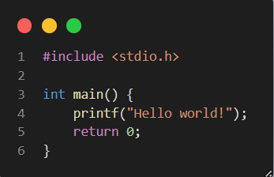

**Buổi 1**

Chương trình C đầu tiên

Nhập xuất cơ bản

Toán tử, ép kiểu dữ liệu

**Buổi 2**

Câu lệnh điều kiện if else

Câu lệnh điều kiện sử dụng toán tử 3 ngôi

Câu lệnh điều kiện dùng switch-case

Vòng lặp for (thường dùng đến 90%)

Vòng lặp while

Vòng lặp do-while

**Buổi 3**

Hàm con

Mảng 1 chiều

Mảng đánh dấu

**Buổi 4**

Hàm kiểm tra nguyên tố

-   Độ phức tạp thuật toán là **O(log(n))**

Sàng nguyên tố

-   Độ phức tạp thuật toán là **O(n.log(n))**

Sắp xếp nổi bọt (Bubble sort)

-   Độ phức tạp thuật toán là **O(n\^2)**

Tìm kiếm tuần tự

-   Độ phức tạp thuật toán là **O(n)**
-   Duyệt trâu tìm phần tử cần tìm

Tìm kiếm nhị phân

-   Độ phức tạp thuật toán là **O(log(n))**
-   Mảng đã được sắp xếp sẵn.
-   Trả về vị trí của phần tử cần tìm ở trong mảng.

